# Airboard - Modern Application Portal

<div align="center">

[](https://opensource.org/licenses/MIT)
[](https://docker.com)
[](https://golang.org)
[](https://vuejs.org)
[](https://goauthentik.io)

*A modern, secure application portal with user management, SSO integration, and Docker support*

[Quick Start](#quick-start) • [Features](#features) • [Installation](#installation) • [Documentation](#documentation) • [API](#api)

---

**📖 Available in multiple languages:**

[🇬🇧 English](README.md) | [🇫🇷 Français](README.fr.md)

</div>

---

## Table of Contents

- [About](#about)
- [Key Features](#key-features)
- [Screenshots](#screenshots)
- [Quick Start](#quick-start)
- [Detailed Installation](#detailed-installation)
- [Configuration](#configuration)
- [Architecture](#architecture)
- [Security](#security)
- [API Reference](#api-reference)
- [Troubleshooting](#troubleshooting)
- [Contributing](#contributing)
- [License](#license)

---

## About

**Airboard** is a comprehensive internal portal platform designed to empower organizations with centralized access to applications, real-time communications, and actionable insights—all in one place.

### Main Objective

In a modern professional environment, organizations need more than just a link directory. **Airboard** addresses this by providing a complete digital workplace solution:

- **Unified Application Portal** - Centralized dashboard with customizable access to all your tools
- **News Hub** - Rich internal communication system with articles, tutorials, announcements, and FAQs
- **Analytics Dashboard** - Track application usage, user engagement, and content performance
- **Announcement System** - Broadcast important messages to teams instantly
- **User Favorites** - Personalized experience with favorite apps and content
- **Delegated Management** - Group Admin role for managing private app groups
- **Role-Based Management** - Granular permissions for Admins, Group Admins, Editors, and Users
- **Multi-Language Support** - Available in French, English, Spanish, and Arabic
- **SSO Integration** - Seamless authentication with Authentik, Microsoft 365, LDAP, and more
- **Docker-Ready** - Deploy in minutes with full containerization

### Use Cases

- **Enterprise Communication**: Publish company news, policy updates, and knowledge base articles
- **IT Services**: Application portal + technical documentation + usage analytics
- **HR & Internal Comms**: Share announcements, employee handbooks, tutorials, and FAQs
- **Department Dashboards**: Customized views per team (HR, Finance, Sales) with relevant apps
- **Project Collaboration**: Team-specific portals with apps, announcements, and documentation
- **Analytics & Insights**: Track most-used applications, monitor engagement, understand user behavior

Airboard transforms how organizations manage digital resources, internal communications, and user engagement.

---

## Key Features

### Authentication & Security

- **Dual Authentication**
  - Classic username/password login
  - SSO via Authentik (Microsoft 365, Google, LDAP, etc.)
  - Auto-provisioning of SSO users
  - Automatic role mapping via Authentik groups

- **Enhanced Security (OWASP 2025)**
  - JWT authentication with refresh tokens
  - Configurable bcrypt hashing (cost 10-31)
  - CSRF and XSS protection
  - Security headers (CSP, CORS)
  - Strict input validation
  - SQL injection protection
  - Rate limiting on sensitive endpoints

- **Integrated OAuth2**
  - Google OAuth2
  - Microsoft OAuth2
  - Configuration via admin interface
  - Secure token management

### User Management & Permissions

- **Role System**
  - **Admin**: Full system access
  - **Group Admin**: Delegated management of private groups and applications
  - **Editor**: Create and manage articles
  - **User**: Access to assigned applications

- **User Management**
  - Complete CRUD operations
  - Group and role assignment
  - User favorites management
  - Customizable user profiles

- **Group Management**
  - Create and organize groups
  - Public and private groups
  - Assign Group Admins
  - Granular access control

### Group Admin System (Delegation)

- **Delegated Management**
  - Group Admins can manage their assigned groups
  - Create private application groups
  - Manage applications within their groups
  - Create and modify articles
  - No access to users or global settings

- **Private Application Groups**
  - Visible only to assigned groups
  - Group ownership (OwnerGroupID)
  - Permissions verified at each operation
  - Complete separation from public groups

### Application Portal

- **Application Organization**
  - Public and private application groups
  - Custom icons (Iconify)
  - Thematic colors per group
  - Configurable URLs and descriptions
  - Advanced sorting and filtering

- **User Favorites**
  - Pin favorite applications
  - Quick access from dashboard
  - Real-time synchronization

- **Usage Analytics**
  - Track clicks per application
  - Unique users
  - 30-day activity charts
  - Top applications

### News Hub

- **Rich Editor (Tiptap)**
  - Full WYSIWYG editor
  - Code blocks with syntax highlighting
  - Tables, lists, links
  - Text alignment
  - Images and media

- **Content Organization**
  - Categories (General, Tutorials, Announcements, FAQ)
  - Multiple dynamic tags
  - SEO-friendly slugs
  - Pin important articles

- **User Engagement**
  - Reaction system (👍, ❤️, 🎉)
  - Per-user view tracking
  - Unique view counters
  - Detailed analytics

- **Display Modes**
  - Grid view (cards)
  - List view (compact)
  - Table view (very compact)
  - Advanced filters (category, type, tags)
  - Full-text search

### Polls & Surveys System

- **Interactive Polls**
  - Single choice or multiple choice polls
  - Anonymous or named voting
  - Scheduled polls (start/end date)
  - Target specific groups or all users
  - Link polls to news articles or announcements

- **Poll Management**
  - Create and edit polls (Admin & Group Admin)
  - Real-time results visualization
  - Result visibility control (always, after voting, after closing)
  - Vote tracking and analytics

- **User Participation**
  - Easy voting interface
  - View results based on permissions
  - Vote history tracking
  - Voter details (if not anonymous)

- **Integration**
  - Polls widget on dashboard
  - Embedded in news articles
  - Standalone polls page
  - Export results to CSV

### In-App Notifications

- **Notification System**
  - Real-time in-app notifications
  - Notification bell with unread count
  - Multiple notification types (system, news, announcements, events)
  - Priority levels (normal, important, urgent)

- **Notification Types**
  - System notifications (login, role changes, access granted/revoked)
  - Content notifications (new articles, new polls, announcements)
  - Engagement notifications (reactions, comments, mentions)
  - Custom admin notifications

- **User Experience**
  - Unread/read status tracking
  - Mark as read/unread
  - Mark all as read
  - Delete notifications
  - Redirect to action URL on click

- **Management**
  - Notification center page
  - Filter by type and status
  - Automatic cleanup of old notifications
  - Push notifications (planned)

### Announcement System

- **Dynamic Banners**
  - Display on dashboard
  - Types: Info, Warning, Error, Success
  - Validity period (start/end date)
  - Display priority

- **Centralized Management**
  - Create and modify via admin
  - Activation/deactivation
  - Preview

### Analytics & Reporting

- **Analytics Dashboard**
  - Global statistics (users, apps, articles)
  - Daily activity charts
  - Top applications and users
  - News analytics

- **Usage Tracking**
  - Clicks per application
  - Article views
  - Reactions and engagement
  - Data export

### Internationalization

- **Multi-Language Support**
  - French (fr)
  - English (en)
  - Spanish (es)
  - Arabic (ar)
  - Integrated language selector
  - Complete translations

### Version Management

- **Auto-Update System**
  - Automatic new version checking
  - GitHub Releases integration
  - Update notifications
  - Accessible changelog
  - Configure via GITHUB_REPO

### User Interface

- **Modern Design**
  - Responsive TailwindCSS
  - Dark mode
  - Smooth animations
  - Intuitive navigation

- **Reusable Components**
  - Standardized modals
  - Application cards
  - Validated forms
  - Loaders and notifications

---

## Screenshots

### Dashboard & Applications

<div align="center">

**Main Dashboard**


</div>

### News Hub

<div align="center">

**Grid View**
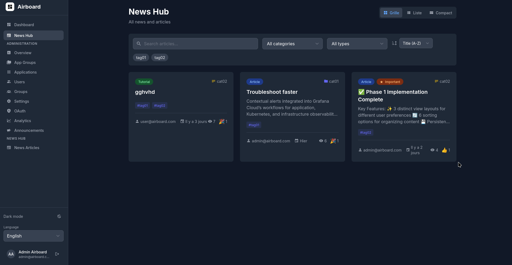

**Compact View**
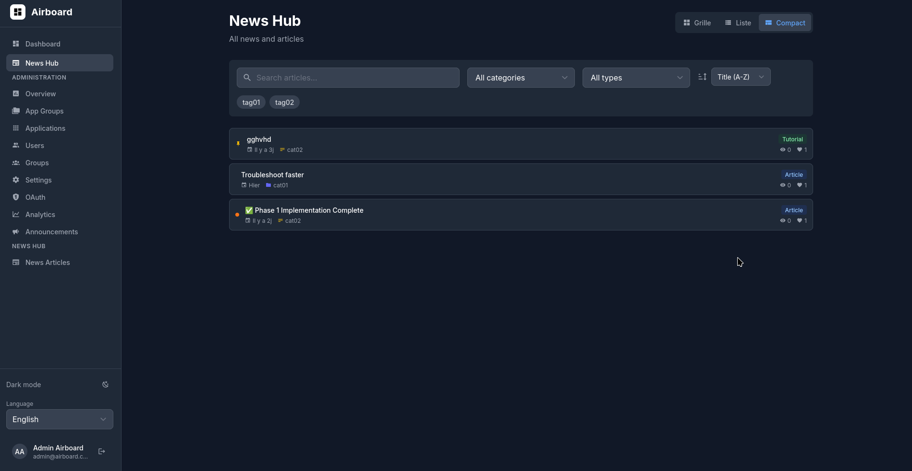

**List View**
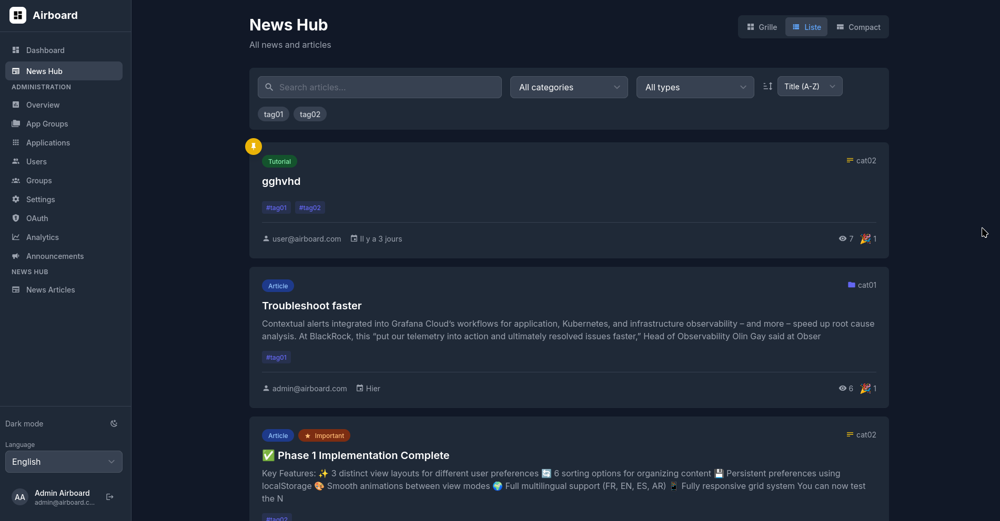

**News Management**
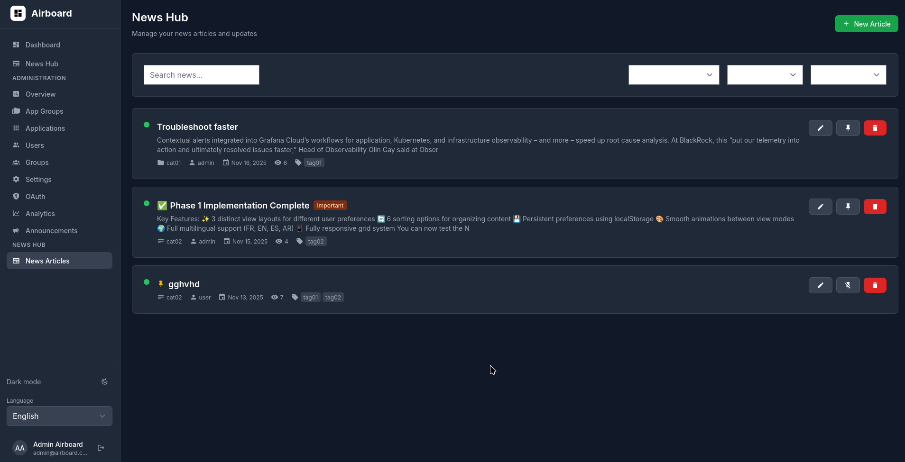

**Rich Text Editor**
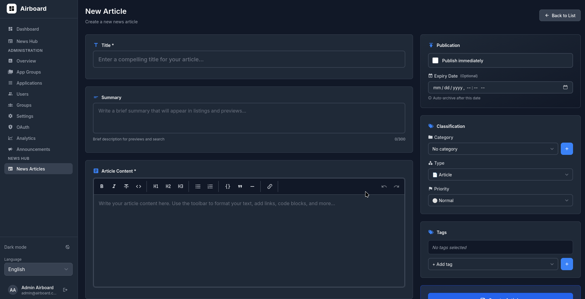

</div>

### Administration

<div align="center">

**Overview**
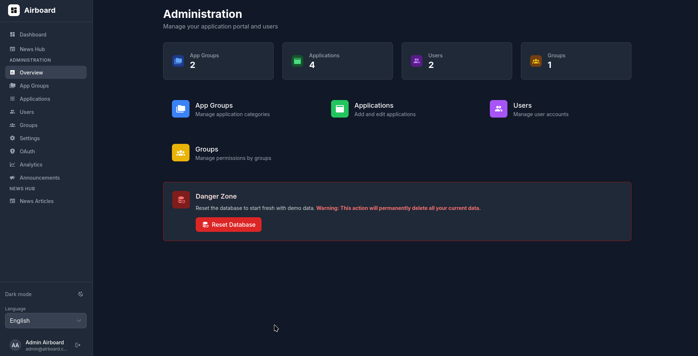

**App Groups Management**
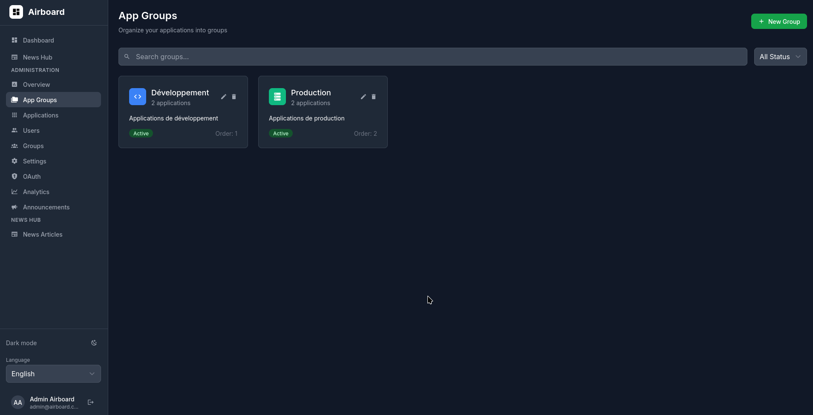

**Applications Management**
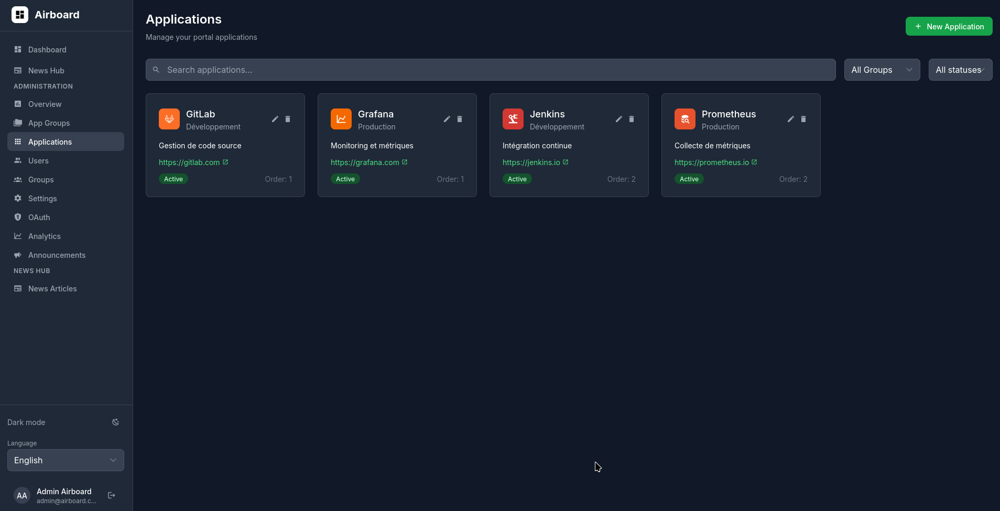

**User Management**
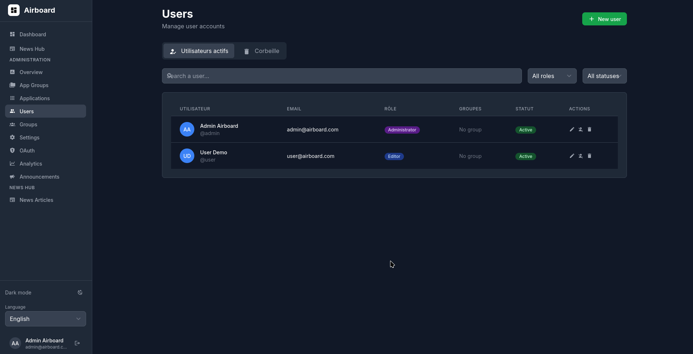

**Groups Management**
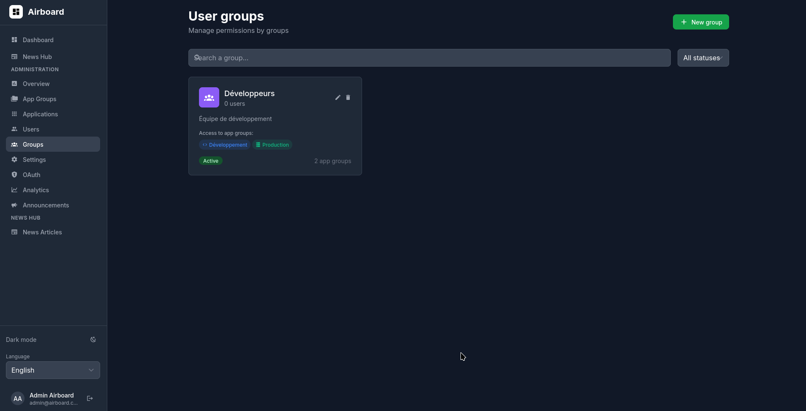

**Settings**
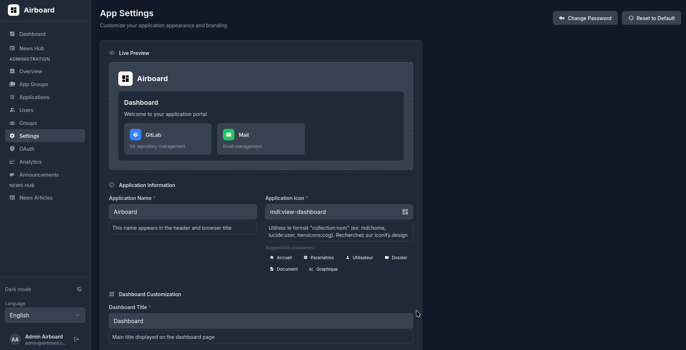

**OAuth**
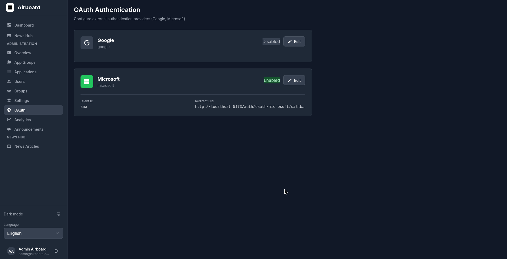

**Analytics**
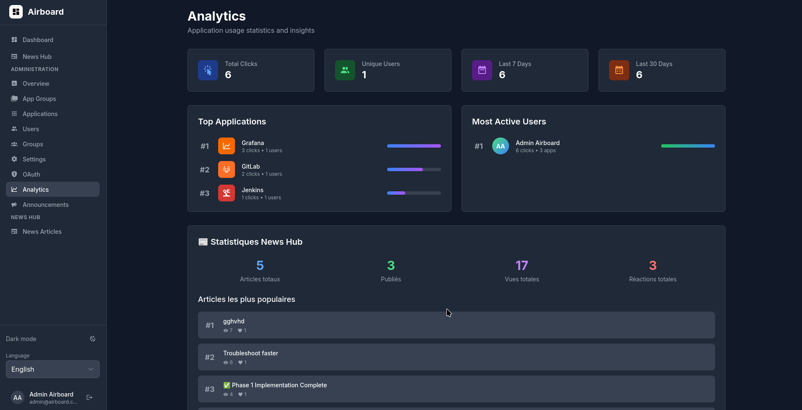

**Announcements Management**
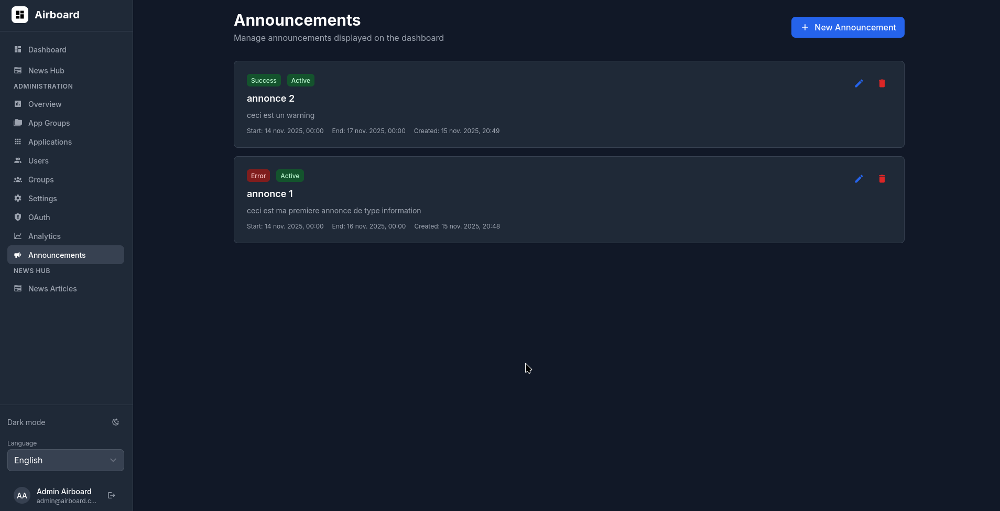

**Announcement Editor**
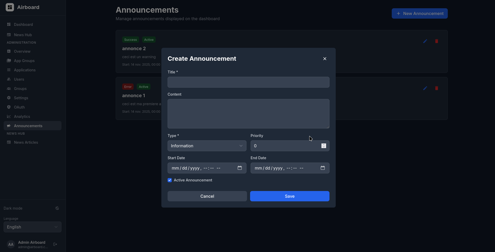

</div>

---

## Quick Start

### Option 1: Docker Compose (Recommended)

```bash
# Clone the repository
git clone https://github.com/your-username/airboard.git
cd airboard

# Start Docker (if needed)
sudo systemctl start docker

# Configure variables (optional)
cp .env.example .env
# Edit .env if needed

# Build and start
docker-compose build
docker-compose up -d

# Check status
docker-compose ps
```

**Access:** http://localhost

**Default accounts:**
- **Admin**: `admin` / `admin123`
- **User**: `user` / `user123`

**IMPORTANT:** Change default passwords on first login.

### Option 2: Coolify Deployment

1. Create a new project in Coolify
2. Deploy from Git: `https://github.com/your-username/airboard.git`
3. Build Pack: `docker-compose`
4. File: `docker-compose.prod.yaml`
5. Configure environment variables (see [Configuration](#configuration))
6. Deploy

### Option 3: Development Mode

```bash
# Backend
cd backend
go mod download
go run main.go

# Frontend (another terminal)
cd frontend
npm install
npm run dev
```

**Access:** http://localhost:3000

---

## Detailed Installation

### Prerequisites

**For Docker (Production):**
- Docker 20.10+
- Docker Compose 2.0+
- 2 GB RAM minimum
- 10 GB disk space

**For Development:**
- Go 1.21+
- Node.js 18+
- PostgreSQL 15+
- 4 GB RAM minimum

### Docker Installation (Production)

#### 1. Install Docker

**Ubuntu/Debian:**
```bash
# Install Docker
curl -fsSL https://get.docker.com -o get-docker.sh
sudo sh get-docker.sh

# Add user to docker group
sudo usermod -aG docker $USER

# Start Docker
sudo systemctl start docker
sudo systemctl enable docker

# Verify
docker --version
docker-compose --version
```

**CentOS/RHEL:**
```bash
sudo yum install -y docker docker-compose
sudo systemctl start docker
sudo systemctl enable docker
```

#### 2. Clone the Project

```bash
git clone https://github.com/your-username/airboard.git
cd airboard
```

#### 3. Configure Variables

```bash
# Copy template
cp .env.example .env

# Edit with your values
nano .env
```

**Critical variables to change in production:**

```env
# Database (REQUIRED)
DB_PASSWORD=your_secure_password

# JWT (REQUIRED)
JWT_SECRET=your-very-long-jwt-secret-minimum-32-characters

# Application
PUBLIC_URL=https://your-domain.com

# SSO (if used)
SSO_ENABLED=true
SSO_ADMIN_GROUPS=airboard-admins,your-admin-group

# GitHub Updates (optional)
GITHUB_REPO=your-username/airboard
GITHUB_TOKEN=ghp_your_github_token
```

#### 4. Deploy

```bash
# Build images
docker-compose build

# Start services
docker-compose up -d

# Check logs
docker-compose logs -f

# Check status
docker-compose ps
```

#### 5. Verification

```bash
# Test access
curl http://localhost/health

# Check database
docker-compose exec postgres psql -U airboard -d airboard -c "\dt"

# Backend logs
docker-compose logs backend

# Frontend logs
docker-compose logs frontend
```

### Coolify Installation (Cloud)

#### 1. Prepare Repository

```bash
# Fork or clone
git clone https://github.com/your-username/airboard.git
cd airboard

# Push to your GitHub repo
git remote set-url origin https://github.com/YOUR_USERNAME/airboard.git
git push
```

#### 2. Coolify Configuration

1. **Create a Project**
   - Name: Airboard
   - Environment: Production

2. **Add a Service**
   - Type: Git Repository
   - Repository: your GitHub repo
   - Branch: main
   - Build Pack: docker-compose

3. **Select docker-compose.prod.yaml**
   - In Settings > Build
   - Docker Compose File: `docker-compose.prod.yaml`

4. **Configure Environment Variables**

Minimum variables:
```env
DB_PASSWORD=secure_password_123
JWT_SECRET=very-long-jwt-secret-at-least-32-random-chars
PUBLIC_URL=https://airboard.your-domain.com
SSO_ENABLED=false
```

Complete variables (recommended):
```env
# Database
DB_HOST=postgres
DB_PORT=5432
DB_USER=airboard
DB_PASSWORD=very_secure_password_123
DB_NAME=airboard

# JWT
JWT_SECRET=your-super-long-and-random-jwt-secret-minimum-32-chars
JWT_TOKEN_EXPIRATION_HOURS=24
JWT_REFRESH_EXPIRATION_DAYS=7

# Security
BCRYPT_COST=12

# Application
GIN_MODE=release
PUBLIC_URL=https://airboard.your-domain.com
SIGNUP_ENABLED=true

# SSO (if using Authentik)
SSO_ENABLED=true
SSO_AUTO_PROVISION=true
SSO_DEFAULT_ROLE=user
SSO_DEFAULT_GROUP=Common
SSO_ADMIN_GROUPS=airboard-admins,it-admins

# GitHub Updates (optional)
GITHUB_REPO=your-username/airboard
GITHUB_TOKEN=ghp_your_personal_token
```

5. **Deploy**
   - Click "Deploy"
   - Wait for build completion (5-10 minutes)
   - Check logs

6. **DNS Configuration**
   - Add DNS A record to Coolify IP
   - Or CNAME to Coolify domain

#### 3. Post-Deployment Verification

```bash
# Test health
curl https://airboard.your-domain.com/health

# Should return: {"status":"healthy"}
```

### SSO Installation (Authentik + Nginx Proxy Manager)

#### Architecture

```
Internet → Nginx Proxy Manager → Authentik → Coolify → Airboard
```

#### 1. Authentik Configuration

**Create an Application:**
1. Applications > Create
2. Name: Airboard
3. Slug: airboard
4. Provider: Create new Proxy Provider

**Configure Provider:**
- Type: Proxy Provider
- Authorization flow: default-provider-authorization-implicit-consent
- External host: `https://airboard.your-domain.com`
- Internal host: `http://coolify-airboard:80`
- Mode: Forward auth (single application)

**Create Groups:**
1. Directory > Groups > Create
2. Create `airboard-admins` for administrators
3. Create `airboard-users` for standard users
4. Assign users to groups

#### 2. Nginx Proxy Manager Configuration

**Create Proxy Host:**
1. Hosts > Proxy Hosts > Add Proxy Host
2. Domain Names: `airboard.your-domain.com`
3. Forward Hostname/IP: Coolify domain or IP
4. Forward Port: 80
5. Cache Assets: ON
6. Block Common Exploits: ON
7. Websockets Support: ON

**Configure Authentik Authentication:**
1. Access List > Create Access List
2. Authorization > Authentik
3. Provider: Select Airboard provider

**Advanced Configuration (Custom Nginx Config):**
```nginx
location / {
    proxy_pass $forward_scheme://$server:$port;
    proxy_set_header Host $host;
    proxy_set_header X-Real-IP $remote_addr;
    proxy_set_header X-Forwarded-For $proxy_add_x_forwarded_for;
    proxy_set_header X-Forwarded-Proto $scheme;
    proxy_set_header X-Forwarded-Host $host;
    proxy_set_header X-Forwarded-Port $server_port;

    # Authentik SSO Headers (CRITICAL)
    proxy_set_header X-authentik-email $authentik_email;
    proxy_set_header X-authentik-username $authentik_username;
    proxy_set_header X-authentik-groups $authentik_groups;
    proxy_set_header X-authentik-uid $authentik_uid;
}
```

#### 3. Airboard SSO Configuration

In Coolify, set:
```env
SSO_ENABLED=true
SSO_AUTO_PROVISION=true
SSO_DEFAULT_ROLE=user
SSO_DEFAULT_GROUP=Common
SSO_ADMIN_GROUPS=airboard-admins
```

#### 4. Test SSO Flow

1. Access `https://airboard.your-domain.com`
2. Redirect to Authentik
3. Login with Microsoft 365 / Google / LDAP
4. Authentik authenticates and returns to Airboard
5. Airboard auto-provisions user
6. Redirect to dashboard

### Development Installation

#### 1. Prerequisites

```bash
# Install Go
wget https://go.dev/dl/go1.21.linux-amd64.tar.gz
sudo tar -C /usr/local -xzf go1.21.linux-amd64.tar.gz
export PATH=$PATH:/usr/local/go/bin
go version

# Install Node.js
curl -fsSL https://deb.nodesource.com/setup_18.x | sudo -E bash -
sudo apt-get install -y nodejs
node --version
npm --version

# Install PostgreSQL
sudo apt install postgresql postgresql-contrib
sudo systemctl start postgresql
sudo systemctl enable postgresql
```

#### 2. Database Configuration

```bash
# Connect to PostgreSQL
sudo -u postgres psql

# Create database and user
CREATE DATABASE airboard;
CREATE USER airboard WITH PASSWORD 'airboard123';
GRANT ALL PRIVILEGES ON DATABASE airboard TO airboard;
\q
```

#### 3. Backend Configuration

```bash
cd backend

# Create .env
cat > .env << EOF
DB_HOST=localhost
DB_PORT=5432
DB_USER=airboard
DB_PASSWORD=airboard123
DB_NAME=airboard
JWT_SECRET=dev-secret-key-not-for-production
GIN_MODE=debug
SSO_ENABLED=false
EOF

# Install dependencies
go mod download

# Start server
go run main.go
```

Backend starts on **http://localhost:8080**

#### 4. Frontend Configuration

```bash
cd frontend

# Install dependencies
npm install

# Create .env.local
cat > .env.local << EOF
VITE_API_URL=http://localhost:8080/api/v1
EOF

# Start dev server
npm run dev
```

Frontend starts on **http://localhost:3000**

#### 5. Access & Test

- Frontend: http://localhost:3000
- Backend API: http://localhost:8080/api/v1
- Health check: http://localhost:8080/health

**Test accounts:**
- Admin: `admin` / `admin123`
- User: `user` / `user123`

---

## Configuration

### Environment Variables

All variables can be configured via:
- **Coolify**: Environment Variables section
- **Docker Compose**: Shell variables or `.env` file
- **Development**: `.env` file in root directory

#### Database

| Variable | Description | Default | Required |
|----------|-------------|---------|----------|
| `DB_HOST` | PostgreSQL host | `postgres` | No |
| `DB_PORT` | PostgreSQL port | `5432` | No |
| `DB_USER` | Database user | `airboard` | No |
| `DB_PASSWORD` | Database password | `airboard123` | **YES (prod)** |
| `DB_NAME` | Database name | `airboard` | No |

#### JWT & Security

| Variable | Description | Default | Required |
|----------|-------------|---------|----------|
| `JWT_SECRET` | JWT secret key (min 32 chars) | Auto-generated | **YES (prod)** |
| `JWT_TOKEN_EXPIRATION_HOURS` | Access token duration (hours) | `24` | No |
| `JWT_REFRESH_EXPIRATION_DAYS` | Refresh token duration (days) | `7` | No |
| `BCRYPT_COST` | Bcrypt cost (10-31) | `12` | No |

**Secure JWT_SECRET generation:**
```bash
# Option 1: OpenSSL
openssl rand -base64 64

# Option 2: Python
python3 -c "import secrets; print(secrets.token_urlsafe(64))"

# Option 3: Leave empty for auto-generation
JWT_SECRET=
```

#### Application

| Variable | Description | Default | Required |
|----------|-------------|---------|----------|
| `GIN_MODE` | Gin mode (`debug`/`release`) | `release` | No |
| `PUBLIC_URL` | Public app URL | `http://localhost` | No |
| `SIGNUP_ENABLED` | Enable classic signup | `true` | No |

#### SSO (Authentik)

**IMPORTANT:** SSO is enabled by default. Disable if not using Authentik.

| Variable | Description | Default | Required |
|----------|-------------|---------|----------|
| `SSO_ENABLED` | Enable SSO | `true` | **YES (disable if no SSO)** |
| `SSO_AUTO_PROVISION` | Auto-create SSO users | `true` | No |
| `SSO_DEFAULT_ROLE` | Default role (`user`/`admin`) | `user` | No |
| `SSO_DEFAULT_GROUP` | Default group | `Common` | No |
| `SSO_ADMIN_GROUPS` | Admin groups (comma-separated) | `airboard-admins` | No |

**SSO headers detected:**
- `X-authentik-email` - User email
- `X-authentik-username` - Username
- `X-authentik-groups` - Groups (comma-separated)
- `X-authentik-uid` - Unique ID

#### OAuth2

| Variable | Description | Configuration |
|----------|-------------|---------------|
| Google OAuth | Google configuration | Via admin interface |
| Microsoft OAuth | Microsoft configuration | Via admin interface |

Configure via `/admin/oauth` in the interface.

#### Automatic Updates

| Variable | Description | Example |
|----------|-------------|---------|
| `GITHUB_REPO` | GitHub repo (format `owner/repo`) | `username/airboard` |
| `GITHUB_TOKEN` | GitHub token (optional) | `ghp_xxxxx` |

Leave `GITHUB_REPO` empty to disable checks.

#### Media Storage (Optional)

| Variable | Description | Default |
|----------|-------------|---------|
| `STORAGE_TYPE` | Type (`local`/`s3`/`minio`) | `local` |
| `UPLOAD_DIR` | Local directory | `./uploads` |
| `S3_BUCKET` | S3/MinIO bucket name | - |
| `S3_REGION` | S3 region | - |
| `S3_ENDPOINT` | MinIO endpoint | - |
| `S3_ACCESS_KEY` | Access Key | - |
| `S3_SECRET_KEY` | Secret Key | - |

### Production Security Checklist

Before deploying to production:

- [ ] **Change `DB_PASSWORD`** - Strong password (16+ chars)
- [ ] **Configure `JWT_SECRET`** - Random secret (32+ chars)
- [ ] **Set `PUBLIC_URL`** - Production HTTPS URL
- [ ] **Configure `SSO_ENABLED`** - `true` if SSO, `false` otherwise
- [ ] **Verify `BCRYPT_COST`** - Minimum 12, recommended 13
- [ ] **Enable `GIN_MODE=release`** - Production mode
- [ ] **Configure `SSO_ADMIN_GROUPS`** - Real groups
- [ ] **Change default passwords** - `admin` and `user`
- [ ] **Enable HTTPS** - Via Nginx/Caddy/Traefik
- [ ] **Configure DB backups** - PostgreSQL backups
- [ ] **Check logs** - No errors at startup

**Production configuration example:**
```env
DB_PASSWORD=K8$mP9#nQ2@vL5*wR7&xT4!yU6
JWT_SECRET=a1b2c3d4e5f6g7h8i9j0k1l2m3n4o5p6q7r8s9t0u1v2w3x4y5z6
PUBLIC_URL=https://tools.company.com
SSO_ENABLED=true
SSO_ADMIN_GROUPS=airboard-admins,it-admins,sysadmins
GIN_MODE=release
BCRYPT_COST=13
```

---

## Architecture

### Tech Stack

| Component | Technology | Role |
|-----------|------------|------|
| **Backend** | Go 1.21 + Gin | REST API server |
| **Frontend** | Vue.js 3 + Vite | SPA application |
| **Database** | PostgreSQL 15 | Data persistence |
| **ORM** | GORM | Database abstraction |
| **Authentication** | JWT | Token-based auth |
| **SSO** | Authentik | IdP integration |
| **Text Editor** | Tiptap | WYSIWYG for news |
| **Containerization** | Docker + Compose | Orchestration |
| **Reverse Proxy** | Nginx | Production web server |
| **Styling** | TailwindCSS | Utility-first CSS |
| **Icons** | Iconify | Icon library |
| **State** | Pinia | Vue state management |
| **Routing** | Vue Router | Client routing |
| **i18n** | vue-i18n | Internationalization |

### Backend Architecture (Go)

```
backend/
├── main.go                    # Entry point, routes, migrations
├── config/
│   └── config.go              # Env config, SSO
├── handlers/
│   ├── auth.go                # Login, SSO, refresh
│   ├── users.go               # User CRUD
│   ├── groups.go              # Group CRUD
│   ├── applications.go        # Application CRUD
│   ├── group_admin.go         # Group Admin endpoints
│   ├── analytics.go           # Analytics
│   ├── announcements.go       # Announcements
│   ├── news.go                # News & reactions
│   └── news_categories.go     # Categories & tags
├── middleware/
│   ├── auth.go                # JWT validation
│   ├── group_admin.go         # Group Admin permissions
│   ├── cors.go                # CORS headers
│   ├── sso.go                 # SSO header detection
│   └── editor.go              # Editor middleware
├── models/
│   ├── models.go              # User, Group, App, Analytics
│   └── news.go                # News, Category, Tag, Reaction
└── services/
    └── sso_mapper.go          # SSO user sync
```

**Key patterns:**
- **SSO Flow**: Nginx forward headers → SSO middleware → auto-provision → JWT
- **Auth**: JWT with refresh tokens
- **Authorization**: Role middlewares (`RequireAuth`, `RequireAdmin`, `RequireGroupAdmin`, `RequireEditor`)
- **Group Admin**: Delegated management with permission checks
- **Database**: GORM with auto-migrations
- **Routes**: Grouped under `/api/v1/`

### Frontend Architecture (Vue.js)

```
frontend/src/
├── main.js                    # Entry point
├── App.vue                    # Root component, SSO auto-login
├── router/
│   └── index.js               # Routes + guards
├── stores/
│   ├── auth.js                # Auth state + SSO
│   ├── app.js                 # App state
│   └── favorites.js           # Favorites
├── services/
│   └── api.js                 # All API endpoints
├── views/
│   ├── dashboard/             # Dashboard, Analytics
│   ├── admin/                 # Admin pages
│   ├── group-admin/           # Group Admin pages
│   ├── auth/                  # Login, OAuth callback
│   ├── NewsCenter.vue         # News hub
│   └── NewsDetail.vue         # Article detail
├── components/
│   ├── layout/                # Sidebar, Navbar
│   ├── admin/                 # Admin modals
│   ├── group-admin/           # Group Admin modals
│   ├── news/                  # News components
│   │   ├── RichTextEditor.vue
│   │   ├── TiptapRenderer.vue
│   │   ├── NewsCard.vue
│   │   └── ViewModeSelector.vue
│   └── dashboard/             # Dashboard components
└── locales/
    ├── fr.json                # French translations
    ├── en.json                # English translations
    ├── es.json                # Spanish translations
    └── ar.json                # Arabic translations
```

**Key patterns:**
- **State**: Pinia for auth, settings, favorites
- **SSO Auto-Login**: `App.vue` checks SSO session on mount
- **API**: Centralized in `services/api.js`
- **Guards**: Auth + role verification in router
- **Editing**: Tiptap for rich content

### Data Models (GORM)

**Main models:**

- **User** - Users with role, SSO, managed groups
- **Group** - User groups with admins
- **AppGroup** - App categories (public/private)
- **Application** - Individual applications
- **News** - Articles with JSON content (Tiptap)
- **NewsCategory** - Categories (General, Tutorials, etc.)
- **Tag** - Tags for articles
- **NewsReaction** - User reactions
- **ApplicationClick** - Click analytics
- **Announcement** - Banner announcements

**Important relationships:**

```
User ←→ Groups (many-to-many)
User ←→ ManagedGroups (many-to-many, Group Admins)
Group ←→ Admins (many-to-many, Group Admins)
Group ←→ AppGroups (many-to-many)
AppGroup → OwnerGroup (belongs-to, for private groups)
Application → AppGroup (belongs-to)
News → Category (belongs-to)
News ←→ Tags (many-to-many)
NewsReaction → User + News (belongs-to)
```

### Detailed SSO Flow

1. **User access** → `https://airboard.company.com`
2. **NPM detects** → not authenticated
3. **Redirect** → Authentik
4. **Authentik auth** → Microsoft 365 / Google / LDAP
5. **NPM forwards** → `X-authentik-*` headers
6. **SSO middleware** → detects headers
7. **SSO Mapper service**:
   - Search user by email
   - Auto-provision if not exists
   - Sync Authentik groups → Airboard groups
   - Assign admin role if group matches `SSO_ADMIN_GROUPS`
8. **JWT generation** → token + refresh token
9. **Frontend response** → localStorage storage
10. **Redirect** → `/dashboard`

---

## Security

### OWASP 2025 Compliance

Airboard implements OWASP security best practices:

#### 1. Broken Access Control
- JWT verification on all protected endpoints
- Role middlewares (`RequireAdmin`, `RequireGroupAdmin`, `RequireEditor`)
- Ownership validation for Group Admins
- No direct access to other groups' resources

#### 2. Cryptographic Failures
- Bcrypt hashing for passwords (configurable cost 10-31)
- JWT signed with strong secret (min 32 chars)
- Expirable tokens and refresh tokens
- HTTPS mandatory in production

#### 3. Injection
- SQL protection via GORM (prepared statements)
- Strict user input validation
- Tiptap data sanitization
- No shell command execution with user input

#### 4. Insecure Design
- Layered architecture (handlers → services → models)
- Separation of concerns
- Least privilege principle (Group Admins)
- Systematic server-side validation

#### 5. Security Misconfiguration
- Security headers (CSP, CORS, X-Frame-Options)
- Release mode in production (`GIN_MODE=release`)
- Secure logs (no secrets)
- Configuration via environment variables

#### 6. Vulnerable Components
- Regularly updated dependencies
- CVE checking with `go mod` and `npm audit`
- Official Docker images
- Automatic security scanning

#### 7. Identification Failures
- Rate limiting on login
- Multi-factor authentication (via SSO)
- Expirable sessions
- Refresh tokens with rotation

#### 8. Software & Data Integrity Failures
- Uploaded file integrity verification
- MIME type validation
- File size limits
- No uploaded code execution

#### 9. Security Logging Failures
- Authentication logs
- Admin action logs
- Security error logs
- SSO monitoring

#### 10. Server-Side Request Forgery
- External URL validation
- No requests to user URLs
- Allowed domain whitelist

### Security Headers

**Nginx (production):**
```nginx
# CSP
add_header Content-Security-Policy "default-src 'self'; script-src 'self' 'unsafe-inline' 'unsafe-eval'; style-src 'self' 'unsafe-inline'; img-src 'self' data: https:; font-src 'self' data:; connect-src 'self'";

# XSS Protection
add_header X-XSS-Protection "1; mode=block";

# Anti-clickjacking
add_header X-Frame-Options "SAMEORIGIN";

# Type sniffing
add_header X-Content-Type-Options "nosniff";

# HTTPS only
add_header Strict-Transport-Security "max-age=31536000; includeSubDomains";
```

### Secure Deployment Recommendations

1. **Enable HTTPS** - Mandatory in production (Let's Encrypt, Cloudflare)
2. **Change secrets** - `DB_PASSWORD`, `JWT_SECRET`
3. **Increase bcrypt** - `BCRYPT_COST=13` or 14
4. **Restrict DB access** - No external exposure
5. **Enable firewall** - Ports 80/443 only
6. **Regular backups** - Daily PostgreSQL dumps
7. **Centralized logs** - Monitoring and alerts
8. **Updates** - Check GitHub releases
9. **Security audits** - Regular testing
10. **Recommend SSO** - Centralized authentication

---

## API Reference

### Base URL

```
http://localhost:8080/api/v1      # Development
https://airboard.company.com/api/v1  # Production
```

### Authentication

All protected endpoints require an `Authorization` header:

```
Authorization: Bearer <jwt_token>
```

### Main Endpoints

#### Authentication

| Method | Endpoint | Description | Auth |
|--------|----------|-------------|------|
| POST | `/auth/login` | Classic login | No |
| POST | `/auth/refresh` | Refresh JWT | No |
| GET | `/auth/sso/auto-login` | SSO auto-login | Headers |

#### Group Admin

| Method | Endpoint | Description | Auth |
|--------|----------|-------------|------|
| GET | `/group-admin/app-groups` | Managed app groups | Group Admin |
| GET | `/group-admin/managed-groups` | Managed groups | Group Admin |
| GET | `/group-admin/applications` | Apps in managed groups | Group Admin |
| POST | `/group-admin/applications` | Create application | Group Admin |
| PUT | `/group-admin/applications/:id` | Update application | Group Admin |
| DELETE | `/group-admin/applications/:id` | Delete application | Group Admin |
| POST | `/group-admin/news` | Create article | Group Admin |
| PUT | `/group-admin/news/:id` | Update article | Group Admin |
| DELETE | `/group-admin/news/:id` | Delete article | Group Admin |

#### Admin - Users

| Method | Endpoint | Description | Auth |
|--------|----------|-------------|------|
| GET | `/users` | List users | Admin |
| GET | `/users/:id` | Get user | Admin |
| POST | `/admin/users` | Create user | Admin |
| PUT | `/admin/users/:id` | Update user | Admin |
| DELETE | `/admin/users/:id` | Delete user | Admin |

#### Admin - Groups

| Method | Endpoint | Description | Auth |
|--------|----------|-------------|------|
| GET | `/admin/groups` | List groups | Admin |
| POST | `/admin/groups` | Create group | Admin |
| PUT | `/admin/groups/:id` | Update group | Admin |
| DELETE | `/admin/groups/:id` | Delete group | Admin |

#### Applications

| Method | Endpoint | Description | Auth |
|--------|----------|-------------|------|
| GET | `/dashboard` | User dashboard | User |
| GET | `/admin/applications` | List applications | Admin |
| POST | `/admin/applications` | Create application | Admin |
| PUT | `/admin/applications/:id` | Update application | Admin |
| DELETE | `/admin/applications/:id` | Delete application | Admin |

#### Favorites

| Method | Endpoint | Description | Auth |
|--------|----------|-------------|------|
| GET | `/favorites` | List favorites | User |
| POST | `/favorites/:id` | Add favorite | User |
| DELETE | `/favorites/:id` | Remove favorite | User |

#### News

| Method | Endpoint | Description | Auth |
|--------|----------|-------------|------|
| GET | `/news` | List articles (filters) | User |
| GET | `/news/article/:slug` | Article detail | User |
| POST | `/news/:id/view` | Increment views | User |
| GET | `/news/:id/reactions` | Article reactions | User |
| POST | `/news/:id/react` | Add reaction | User |
| DELETE | `/news/:id/react` | Remove reaction | User |
| POST | `/editor/news` | Create article | Editor |
| PUT | `/editor/news/:id` | Update article | Editor |
| DELETE | `/editor/news/:id` | Delete article | Editor |
| POST | `/admin/news/:id/pin` | Pin article | Admin |

#### Analytics

| Method | Endpoint | Description | Auth |
|--------|----------|-------------|------|
| GET | `/analytics/dashboard` | Analytics dashboard | Admin |
| POST | `/analytics/click` | Track app click | User |
| GET | `/admin/news/analytics` | News analytics | Admin |

#### Announcements

| Method | Endpoint | Description | Auth |
|--------|----------|-------------|------|
| GET | `/announcements/active` | Active announcements | User |
| GET | `/admin/announcements` | List announcements | Admin |
| POST | `/admin/announcements` | Create announcement | Admin |
| PUT | `/admin/announcements/:id` | Update announcement | Admin |
| DELETE | `/admin/announcements/:id` | Delete announcement | Admin |

#### Polls

| Method | Endpoint | Description | Auth |
|--------|----------|-------------|------|
| GET | `/polls` | List polls (with filters) | User |
| GET | `/polls/:id` | Get poll details | User |
| POST | `/polls/:id/vote` | Vote on a poll | User |
| DELETE | `/polls/:id/vote` | Remove vote | User |
| GET | `/polls/:id/results` | Get poll results | User |
| POST | `/admin/polls` | Create poll | Admin |
| PUT | `/admin/polls/:id` | Update poll | Admin |
| DELETE | `/admin/polls/:id` | Delete poll | Admin |
| POST | `/admin/polls/:id/close` | Close poll | Admin |
| GET | `/admin/polls/stats` | Poll statistics | Admin |
| POST | `/group-admin/polls` | Create poll | Group Admin |
| PUT | `/group-admin/polls/:id` | Update poll | Group Admin |
| DELETE | `/group-admin/polls/:id` | Delete poll | Group Admin |

#### Notifications

| Method | Endpoint | Description | Auth |
|--------|----------|-------------|------|
| GET | `/notifications` | List user notifications | User |
| GET | `/notifications/unread-count` | Get unread count | User |
| PUT | `/notifications/:id/read` | Mark as read | User |
| PUT | `/notifications/:id/unread` | Mark as unread | User |
| PUT | `/notifications/mark-all-read` | Mark all as read | User |
| DELETE | `/notifications/:id` | Delete notification | User |
| DELETE | `/notifications/clear-all` | Clear all notifications | User |
| POST | `/admin/notifications` | Create notification | Admin |
| POST | `/admin/notifications/broadcast` | Broadcast to groups | Admin |
| GET | `/admin/notifications/stats` | Notification statistics | Admin |

### Request Examples

**Login:**
```bash
curl -X POST http://localhost:8080/api/v1/auth/login \
  -H "Content-Type: application/json" \
  -d '{"username":"admin","password":"admin123"}'
```

**Create Application (Group Admin):**
```bash
curl -X POST http://localhost:8080/api/v1/group-admin/applications \
  -H "Authorization: Bearer <token>" \
  -H "Content-Type: application/json" \
  -d '{
    "name":"My App",
    "url":"https://app.example.com",
    "icon":"mdi:rocket",
    "color":"#4F46E5",
    "app_group_id":1
  }'
```

**Create Article:**
```bash
curl -X POST http://localhost:8080/api/v1/editor/news \
  -H "Authorization: Bearer <token>" \
  -H "Content-Type: application/json" \
  -d '{
    "title":"My Article",
    "content":"{\"type\":\"doc\",\"content\":[...]}",
    "category_id":1,
    "type":"article",
    "tag_ids":[1,2]
  }'
```

**Create Poll:**
```bash
curl -X POST http://localhost:8080/api/v1/admin/polls \
  -H "Authorization: Bearer <token>" \
  -H "Content-Type: application/json" \
  -d '{
    "title":"What is your favorite framework?",
    "description":"Help us improve our stack",
    "poll_type":"single",
    "is_anonymous":false,
    "show_results":"after",
    "options":[
      {"text":"Vue.js","order":1},
      {"text":"React","order":2},
      {"text":"Angular","order":3}
    ]
  }'
```

**Vote on Poll:**
```bash
curl -X POST http://localhost:8080/api/v1/polls/1/vote \
  -H "Authorization: Bearer <token>" \
  -H "Content-Type: application/json" \
  -d '{
    "poll_option_id":1
  }'
```

**Get Notifications:**
```bash
curl -X GET http://localhost:8080/api/v1/notifications \
  -H "Authorization: Bearer <token>"
```

**Mark Notification as Read:**
```bash
curl -X PUT http://localhost:8080/api/v1/notifications/1/read \
  -H "Authorization: Bearer <token>"
```

Complete documentation: See [CLAUDE.md](CLAUDE.md) for all endpoints.

---

## Troubleshooting

### SSO not working

**Symptoms:** Login page shown instead of auto-login

**Solutions:**
1. Check `SSO_ENABLED=true` in environment variables
2. Verify Authentik headers in DevTools (Network > Headers)
3. Check backend logs: `docker-compose logs backend | grep SSO`
4. Verify NPM forwards headers (Advanced config)
5. Test with curl:
```bash
curl -H "X-authentik-email: test@example.com" \
     -H "X-authentik-username: test" \
     http://localhost:8080/api/v1/auth/sso/auto-login
```

### 404 API errors

**Symptoms:** API calls return 404

**Solutions:**
1. Check `proxy_set_header Host $host;` in NPM
2. Verify correct Coolify domain
3. Check frontend `nginx.conf` proxies `/api/v1/`
4. Test backend directly: `curl http://backend:8080/health`

### Database connection fails

**Symptoms:** Backend crashes on startup

**Solutions:**
1. Check `DB_HOST=postgres` (Docker service name)
2. Verify `DB_PASSWORD` matches in postgres and backend
3. Wait for health check: `docker-compose logs postgres`
4. Test connection: `docker-compose exec postgres psql -U airboard`

### Port conflicts

**Symptoms:** "port already allocated"

**Solutions:**
1. Check ports 80, 8080, 5432 are free: `sudo netstat -tulpn`
2. Stop conflicting services: `sudo systemctl stop nginx`
3. Use `docker-compose.prod.yaml` with `expose` instead of `ports`

### Slow application

**Symptoms:** High response times

**Solutions:**
1. Check Docker resources: `docker stats`
2. Increase RAM: Modify Docker limits
3. Check DB indexes: `docker-compose exec postgres psql -U airboard -c "\d+ news"`
4. Reduce `BCRYPT_COST` if login slow (min 10, max 13)
5. Check logs: `docker-compose logs --tail=100`

### Database migration failures

**Symptoms:** Errors on backend startup

**Solutions:**
1. Remove volume: `docker-compose down -v`
2. Recreate DB: `docker-compose up -d postgres`
3. Check migration logs: `docker-compose logs backend | grep "migrating"`
4. Manual connection:
```bash
docker-compose exec postgres psql -U airboard -d airboard
\dt   # List tables
\q    # Quit
```

### Large Docker images

**Symptoms:** Slow build, disk space

**Solutions:**
1. Clean images: `docker system prune -a`
2. Optimize build: Multi-stage already implemented
3. Check layers: `docker images`

### Incomplete logs

**Solutions:**
```bash
# Complete logs
docker-compose logs

# Real-time logs
docker-compose logs -f

# Backend only
docker-compose logs -f backend

# Last 100 lines
docker-compose logs --tail=100
```

### Complete reset

To start from scratch:
```bash
# Stop and remove everything
docker-compose down -v

# Remove images
docker rmi airboard-backend airboard-frontend

# Rebuild
docker-compose build --no-cache
docker-compose up -d
```

---

## Documentation

### User Guides

- [**HOW-TO-USE.md**](HOW-TO-USE.md) - Complete usage guide
  - First login and configuration
  - Daily usage
  - Administration
  - Group Admin management
  - Best practices

### Reference Files

- `.env.example` - Environment variables template
- `docker-compose.yaml` - Local orchestration
- `docker-compose.prod.yaml` - Production orchestration (Coolify)

---

## Contributing

Contributions are welcome! Follow these steps:

### 1. Fork & Clone

```bash
# Fork on GitHub, then:
git clone https://github.com/YOUR_USERNAME/airboard.git
cd airboard
```

### 2. Create a Branch

```bash
git checkout -b feature/my-feature
```

### 3. Develop

- Follow existing code style
- Add tests if applicable
- Update documentation

### 4. Commit

```bash
git add .
git commit -m "feat: Add my feature"
```

**Commit convention:**
- `feat:` - New feature
- `fix:` - Bug fix
- `docs:` - Documentation
- `style:` - Formatting
- `refactor:` - Refactoring
- `test:` - Tests
- `chore:` - Maintenance

### 5. Push & PR

```bash
git push origin feature/my-feature
```

Open a Pull Request on GitHub with:
- Clear description
- Screenshots if UI
- Tests performed

### Development Guidelines

- Clean and commented code
- No hardcoded secrets
- Environment variables for config
- Server-side validation
- Appropriate error handling
- Informative logs

---

## Roadmap

| Feature | Status |
|---------|--------|
| JWT Auth | Complete |
| Authentik SSO | Complete |
| Group Admin Role | Complete |
| Private/Public Groups | Complete |
| OAuth2 (Google/MS) | Complete |
| News Hub | Complete |
| Polls & Surveys | Complete |
| In-App Notifications | Complete |
| Analytics | Complete |
| Multi-language | Complete |
| Docker | Complete |
| OWASP 2025 Security | Complete |
| Automated tests | In Progress |
| LDAP Integration | Planned |
| Kubernetes Support | Planned |
| Mobile App | Planned |
| Push Notifications | Planned |
| Public API | Planned |
| WebSocket Real-time | Planned |

---

## Support

- **Documentation**: This README + [HOW-TO-USE.md](HOW-TO-USE.md) + [CLAUDE.md](CLAUDE.md)
- **Issues**: [GitHub Issues](../../issues)
- **Discussions**: [GitHub Discussions](../../discussions)

---

## License

This project is licensed under the **MIT License**. See [LICENSE](LICENSE) for details.

---

## Acknowledgments

- [Vue.js](https://vuejs.org/) - The progressive JavaScript framework
- [Gin](https://gin-gonic.com/) - Fast HTTP web framework for Go
- [Docker](https://docker.com/) - Container platform
- [TailwindCSS](https://tailwindcss.com/) - Utility-first CSS framework
- [Authentik](https://goauthentik.io/) - Open-source identity provider
- [Coolify](https://coolify.io/) - Self-hosted Heroku alternative
- [GORM](https://gorm.io/) - ORM library for Golang
- [Pinia](https://pinia.vuejs.org/) - Vue state management
- [Tiptap](https://tiptap.dev/) - WYSIWYG editor
- All open-source contributors

---

## Project Status

**Current version:** 1.0.0

**Last update:** December 2025

**Maintenance:** Active

**Production ready:** Yes

---

<div align="center">

**If you find this project useful, give it a star!**

[⬆ Back to top](#airboard---modern-application-portal)

</div>
