# 🚀 Airboard - Modern Application Portal

<div align="center">

[](https://opensource.org/licenses/MIT)
[](https://docker.com)
[](https://golang.org)
[](https://vuejs.org)
[](https://goauthentik.io)

*A modern, secure application portal with user management, SSO integration, and Docker support*

[🚀 Quick Start](#-quick-start) • [📖 About](#-about) • [✨ Features](#-features) • [🔧 Installation](#-installation-methods) • [📘 How to Use](#-how-to-use) • [🔐 SSO Setup](#-sso-integration-authentik)

</div>

---

## 📖 About

**Airboard** is a comprehensive internal portal platform designed to empower organizations with centralized access to applications, real-time communications, and actionable insights—all in one place.

### Main Objective

In a modern professional environment, organizations need more than just a link directory. **Airboard** addresses this by providing a complete digital workplace solution:

- **🎯 Unified Application Portal** - Centralized dashboard with customizable access to all your tools and applications
- **📰 News Hub** - Rich internal communication system with articles, tutorials, announcements, and FAQs
- **📊 Analytics Dashboard** - Track application usage, user engagement, and content performance
- **📢 Announcements System** - Broadcast important messages to teams instantly
- **⭐ User Favorites** - Personalized experience with favorite apps and content
- **👥 Role-Based Management** - Granular permissions for Admins, Editors, and Users
- **🌍 Multi-Language Support** - Available in French, English, Spanish, and Arabic
- **🔐 SSO Integration** - Seamless authentication with Authentik, Microsoft 365, LDAP, and more
- **⚡ Docker-Ready** - Deploy in minutes on your infrastructure with full containerization

### Use Cases

- **Enterprise Communication**: Publish company news, policy updates, and knowledge base articles with rich text formatting
- **IT Services**: Application portal + technical documentation + usage analytics for internal tools
- **HR & Internal Comms**: Share announcements, employee handbooks, tutorials, and FAQs across the organization
- **Department Dashboards**: Customized views per team (HR, Finance, Sales) with relevant apps and news
- **Project Collaboration**: Team-specific portals with apps, announcements, and project documentation
- **Analytics & Insights**: Track which applications are most used, monitor content engagement, and understand user behavior

Airboard transforms how organizations manage digital resources, internal communications, and user engagement—providing a single source of truth for your entire workforce.

---

## ✨ Features

### Core Features
- 🔐 **Dual Authentication** - Classic login/password + SSO (Authentik/Microsoft 365)
- 👥 **User Management** - Complete CRUD operations for users and groups
- 🎯 **Application Portal** - Organize apps by groups with custom icons
- ⭐ **User Favorites** - Pin favorite applications for quick access
- 📊 **Analytics Dashboard** - Track application usage and user activity
- 📢 **Announcements System** - Display important messages on dashboard
- 📰 **News Hub** - Internal news and documentation management
- 🌐 **Multi-language** - Support for French, English, Spanish, Arabic
- 🎨 **Modern UI** - Clean, responsive design with dark mode

### News Hub Features
- 📝 **Rich Text Editor** - Tiptap-powered editor with full formatting support
- 🏷️ **Categories & Tags** - Organize articles with dynamic categories and tags
- 👁️ **View Tracking** - Monitor article popularity with view counts
- ❤️ **Reactions System** - Emoji reactions (👍, ❤️, 🎉) for user engagement
- 🔖 **Article Types** - Support for articles, tutorials, announcements, FAQ
- 📌 **Pinning** - Pin important articles to the top
- 🎨 **Multiple View Modes** - Grid, List, and Compact display options
- 🔍 **Advanced Filtering** - Search, category, type, and tag-based filtering
- 📈 **News Analytics** - View counts, reactions, and top articles tracking
- 🔗 **SEO-Friendly URLs** - Slug-based article URLs

### User Roles & Permissions
- 👑 **Admin Role** - Full system access and management
- ✍️ **Editor Role** - Create and manage news articles
- 👤 **User Role** - Access to assigned applications and content
- 🎭 **Role-Based Access Control** - Fine-grained permissions for different features

### Security & Authentication
- 🔒 **JWT Authentication** - Secure token-based auth with refresh tokens
- 🆔 **SSO Integration** - Full Authentik integration with Microsoft 365
- 👤 **Auto-provisioning** - Automatic user creation from SSO
- 🎭 **Role Mapping** - Automatic admin role assignment via Authentik groups
- 🛡️ **Security Headers** - CSP, CORS protection, password hashing

### Analytics & Insights
- 📊 **Application Analytics** - Track clicks, unique users, daily activity
- 📈 **User Activity** - Monitor most active users and applications
- 📰 **News Analytics** - Article views, reactions, and engagement metrics
- 📅 **Daily Activity Charts** - 30-day activity visualization
- 🏆 **Top Content** - Most popular applications and articles

### Deployment & DevOps
- 🐳 **Docker Ready** - Production-ready docker-compose deployment
- ☁️ **Coolify Compatible** - Deploy from GitHub repository
- 🔧 **Environment Variables** - Full externalization for Coolify/Docker
- ⚡ **Fast** - Optimized Vue.js frontend with Go backend
- 📦 **PostgreSQL Integrated** - Embedded database in docker-compose

---

## 📸 Screenshots

### Dashboard & Applications

<div align="center">

**Main Dashboard with Applications**
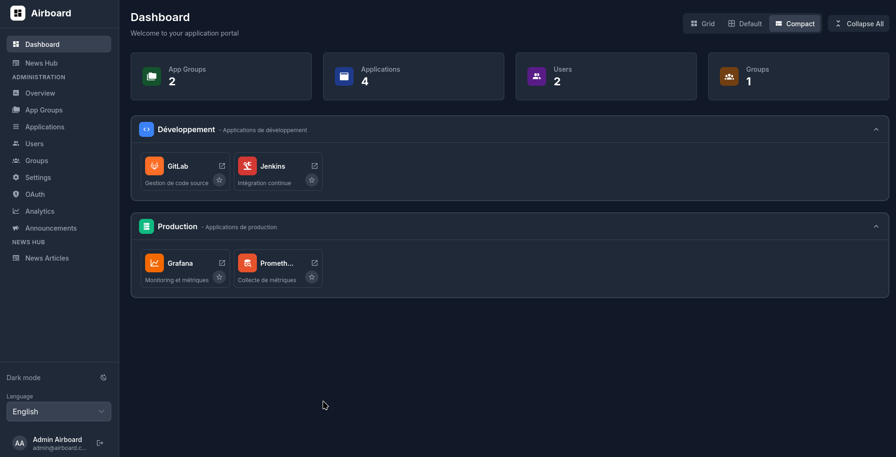

</div>

### News Hub

<div align="center">

**News Hub - Grid View**
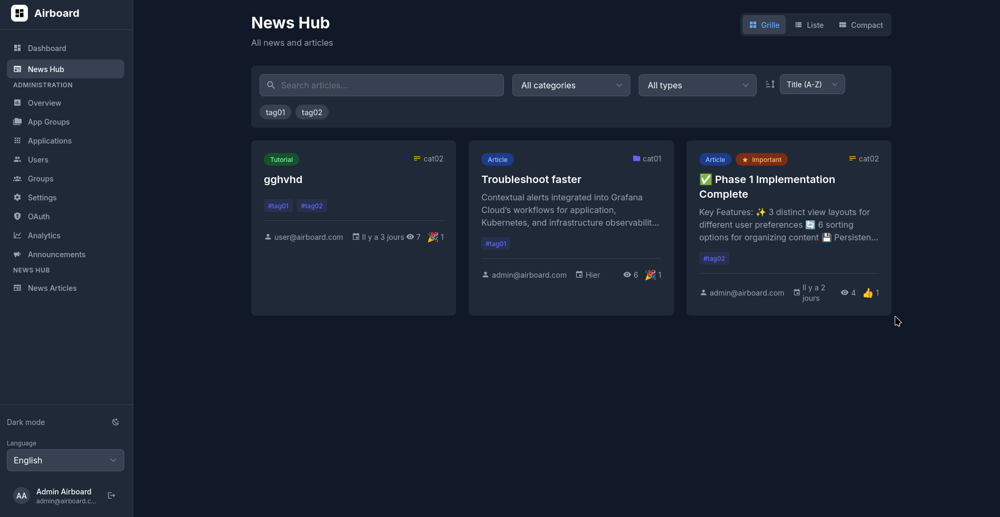

**News compact View**
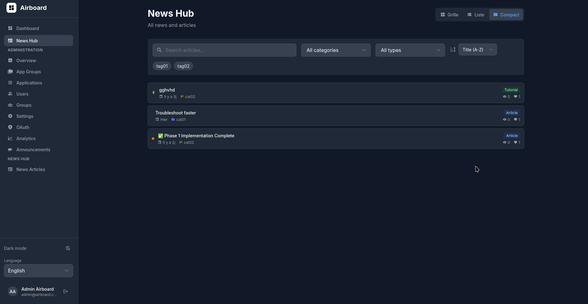

**News Hub - List View**
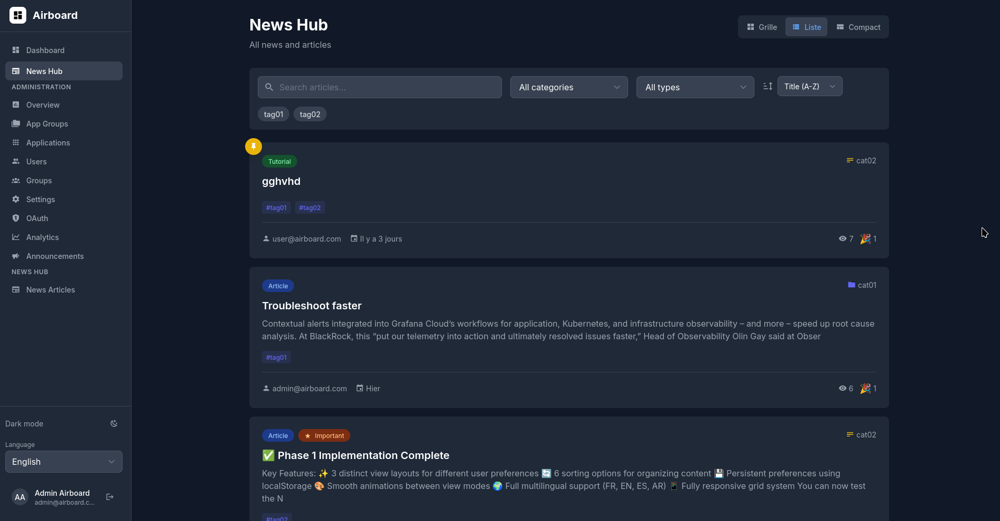

**News Hub Management**
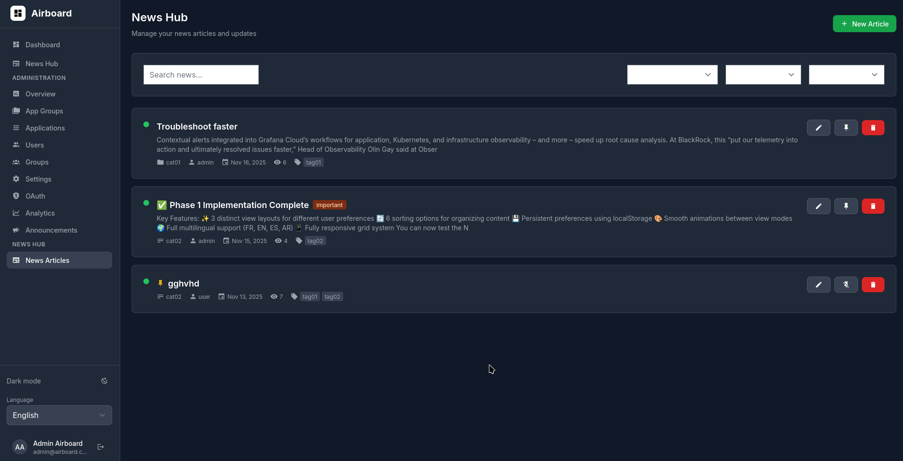

**Rich Text Editor**
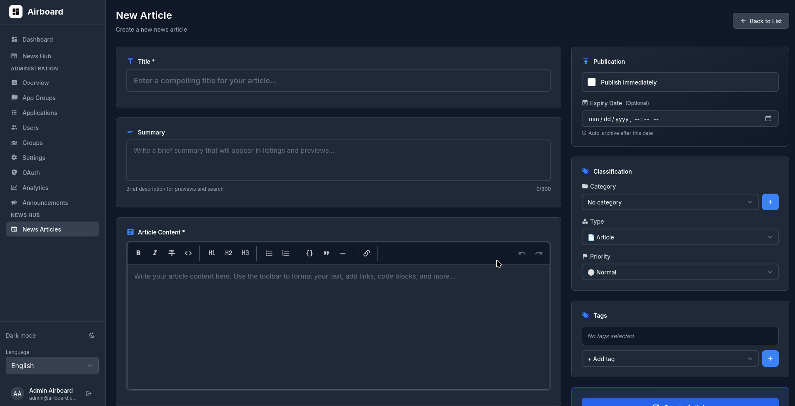

</div>

### Administration

<div align="center">

**Administration -  OverView**
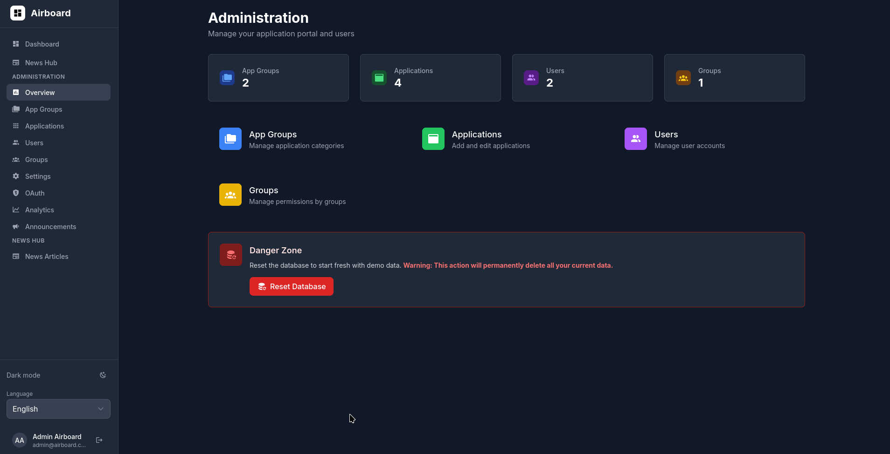

**Administration - App Groups Management**
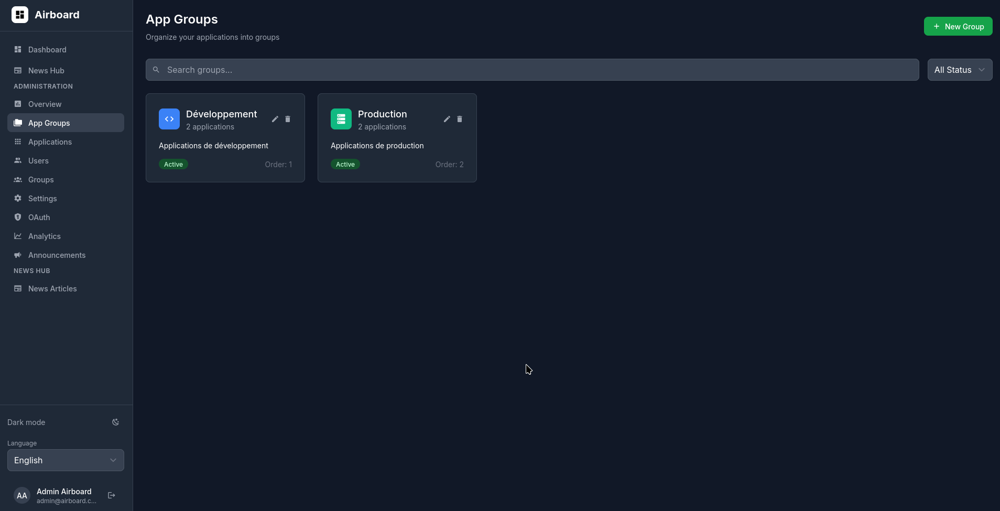

**Administration - Applications Management**
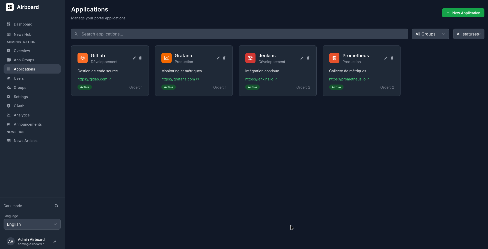

**User Management Interface**
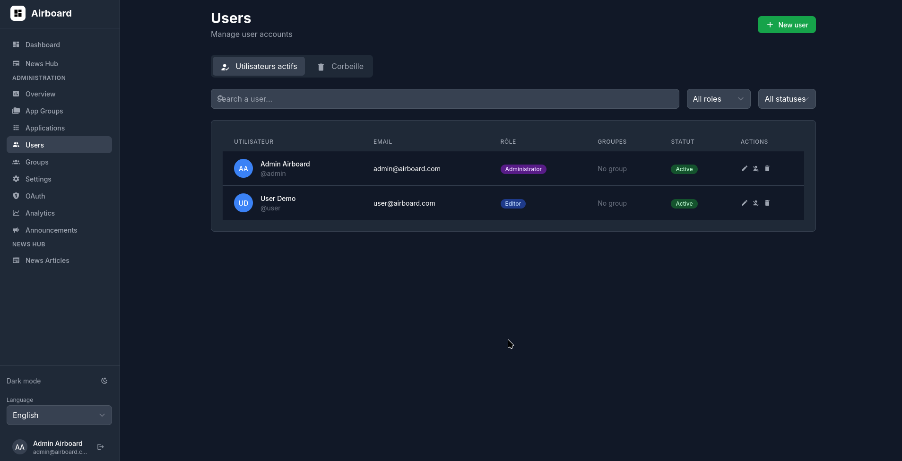

**Groups Management**
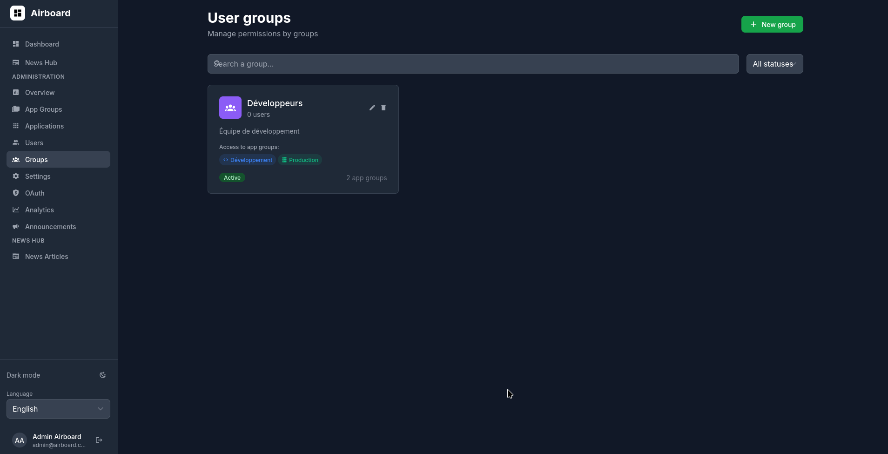

**Settings**
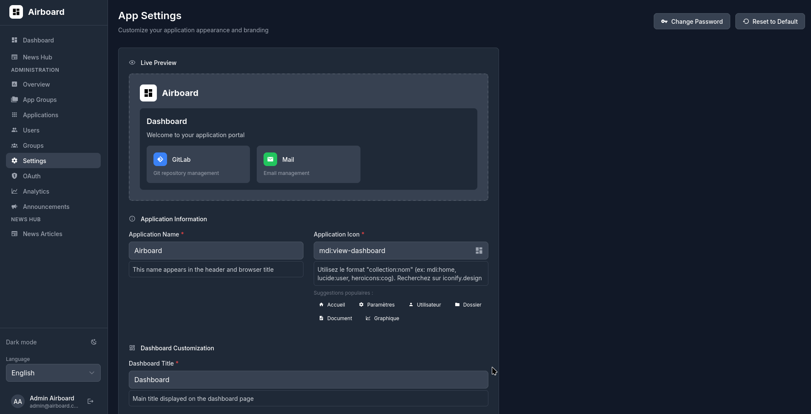

**OAuth**
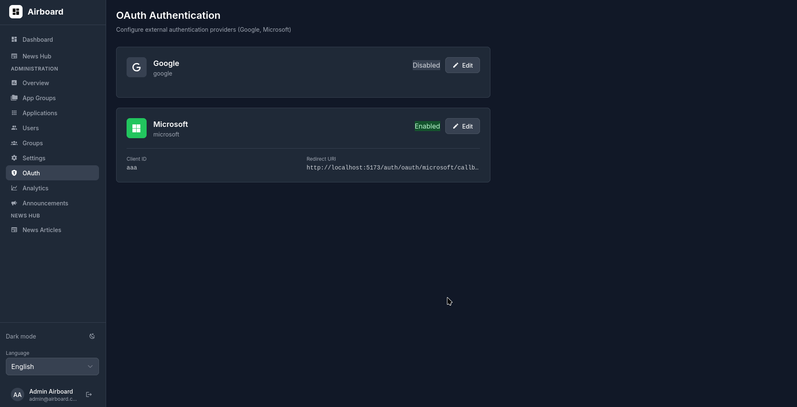

**Analytics Dashboard**
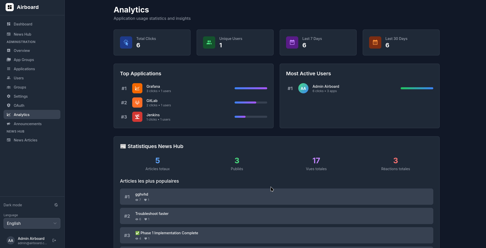

**Annoucments Management**
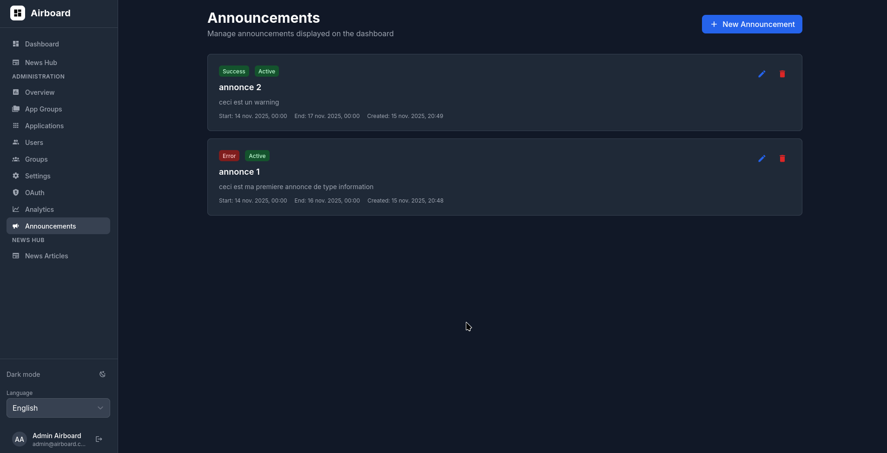

**Annoucments Editor**
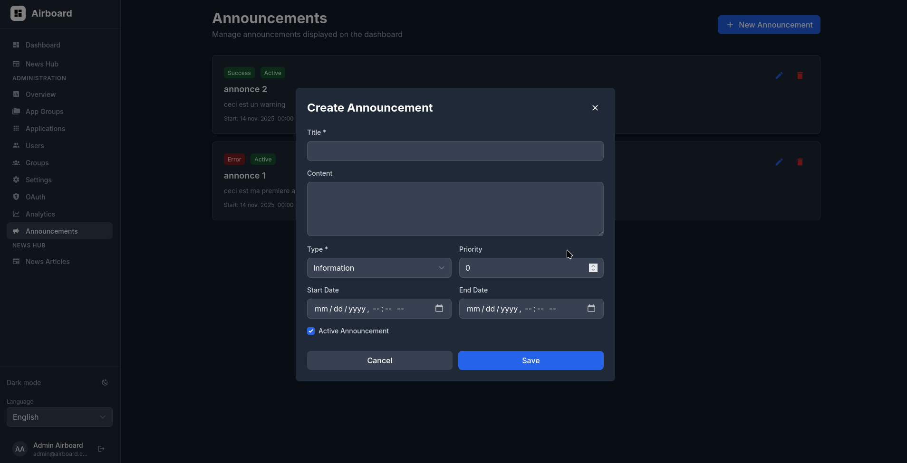

</div>


---

## 🚀 Quick Start

### Option 1: Docker Compose (Production - Recommended)

```bash
# Clone the repository
git clone https://github.com/orionmoon/airboard.git
cd airboard

# Start Docker service
sudo systemctl start docker

# Configure environment variables (optional)
cp .env.example .env
# Edit .env with your settings if needed

# Build and start all services
docker-compose build
docker-compose up -d

# Check status
docker-compose ps
```

**Access:** http://localhost

**Default accounts:**
- **Admin**: username `admin` / password `admin123`
- **User**: username `user` / password `user123`

**Architecture:**
- Frontend (Nginx + Vue.js): Port 80
- Backend (Go API): Proxied via Nginx at `/api/v1`
- PostgreSQL: Internal network only

For detailed instructions and troubleshooting, see [DOCKER_INSTALL.md](DOCKER_INSTALL.md)

### Option 2: Coolify Deployment (Cloud - Recommended for Production)

1. **Create a new project** in Coolify
2. **Select "Deploy from Git"**
3. **Repository**: `https://github.com/orionmoon/airboard.git`
4. **Build Pack**: `docker-compose`
5. **Configure Environment Variables** (see [Configuration](#-configuration))
6. **Deploy**

**Environment Variables to set in Coolify (minimum):**
```env
DB_PASSWORD=your_secure_password
JWT_SECRET=your-very-long-secret-key-minimum-32-characters
SSO_ENABLED=true  # If using Authentik
```

### Option 3: Development Mode

```bash
# Backend
cd backend
go run main.go

# Frontend (in another terminal)
cd frontend
npm install
npm run dev
```

**Access:** http://localhost:5173

---

## 🔧 Installation Methods

### 📦 Method 1: Docker Compose (Standalone)

Best for: Local development, testing, self-hosted deployments

**Requirements:**
- Docker 20.10+
- Docker Compose 2.0+

**Steps:**
```bash
git clone https://github.com/orionmoon/airboard.git
cd airboard
docker-compose up -d
```

**Services started:**
- Frontend (Nginx): Port 80
- Backend (Go API): Port 8080
- PostgreSQL: Port 5432 (internal only)

### ☁️ Method 2: Coolify (GitHub Integration)

Best for: Production deployments, automatic updates, team collaboration

**Requirements:**
- Coolify instance
- GitHub account
- Optional: Nginx Proxy Manager + Authentik for SSO

**Steps:**

1. **Push to GitHub:**
   ```bash
   git clone https://github.com/orionmoon/airboard.git
   cd airboard
   git remote set-url origin https://github.com/YOUR_USERNAME/airboard.git
   git push
   ```

2. **In Coolify:**
   - Create new project
   - Deploy from Git Repository
   - Build pack: `docker-compose`
   - Branch: `main`

3. **Configure Environment Variables** in Coolify UI:
   ```env
   # Database (required)
   DB_USER=airboard
   DB_PASSWORD=your_secure_password_here
   DB_NAME=airboard

   # JWT (required for security)
   JWT_SECRET=your-super-secret-key-at-least-32-chars-long

   # SSO (if using Authentik)
   SSO_ENABLED=true
   SSO_AUTO_PROVISION=true
   SSO_DEFAULT_ROLE=user
   SSO_DEFAULT_GROUP=Common
   SSO_ADMIN_GROUPS=airboard-admins
   ```

4. **Deploy**

### 🔗 Method 3: Nginx Proxy Manager + Authentik (Full SSO Stack)

Best for: Enterprise deployments with centralized authentication

**Architecture:**
```
Internet → Nginx Proxy Manager (+ Authentik) → Coolify → Airboard
```

**Steps:**

1. **Deploy Airboard on Coolify** (Method 2)

2. **Configure Nginx Proxy Manager:**
   - Create proxy host for your domain (e.g., `tools.company.com`)
   - Forward to Coolify domain
   - Enable Authentik authentication

3. **NPM Advanced Configuration:**
   ```nginx
   location / {
       proxy_pass $forward_scheme://$server:$port;
       proxy_set_header Host $host;
       proxy_set_header X-Real-IP $remote_addr;
       proxy_set_header X-Forwarded-For $proxy_add_x_forwarded_for;
       proxy_set_header X-Forwarded-Proto $scheme;
       proxy_set_header X-Forwarded-Host $host;
       proxy_set_header X-Forwarded-Port $server_port;

       # Authentik SSO Headers
       proxy_set_header X-authentik-email $authentik_email;
       proxy_set_header X-authentik-username $authentik_username;
       proxy_set_header X-authentik-groups $authentik_groups;
       proxy_set_header X-authentik-uid $authentik_uid;
   }
   ```

4. **Configure Authentik Provider:**
   - Create new OAuth2/Proxy Provider
   - Link to your application
   - Configure groups (e.g., `airboard-admins` for admin access)

5. **Enable SSO in Airboard:**
   Set `SSO_ENABLED=true` in Coolify environment variables

**Result:** Users authenticated via Microsoft 365 → Authentik → Automatic login to Airboard

---

## 📘 How to Use

**New to Airboard?** Check out our comprehensive getting started guide: **[HOW-TO-USE.md](HOW-TO-USE.md)**

This guide covers:
- 🔐 **First Login** - Default credentials and security setup
- 📊 **Understanding the Dashboard** - Layout and navigation
- 👥 **User Management** - Creating and managing users (admin)
- 🏢 **Group Management** - Organizing by departments/projects (admin)
- 📱 **Application Management** - Adding and configuring applications (admin)
- 🧑‍💼 **Regular User Workflow** - Daily usage for end users
- ✅ **Common Tasks** - Step-by-step scenarios and examples
- 💡 **Best Practices** - Tips for administrators and users
- 🔧 **Troubleshooting** - Solutions to common issues

**Quick Start for Admins:**
1. Login with username `admin` / password `admin123`
2. Change the default password immediately
3. Create groups (e.g., "IT", "Sales", "Common")
4. Add applications with icons and URLs
5. Create user accounts and assign to groups
6. Test with a regular user account

**Quick Start for Users:**
1. Login with your credentials
2. Browse applications on your dashboard
3. Click an application card to open it
4. Use the search bar for quick access

👉 **[Read the full guide →](HOW-TO-USE.md)**

---

## 🔐 SSO Integration (Authentik)

### Overview

Airboard supports **dual-mode authentication**:
- **Classic mode**: Traditional username/password (always available)
- **SSO mode**: Automatic login via Authentik headers (optional)

### How SSO Works

1. **User accesses** `https://tools.company.com`
2. **Nginx Proxy Manager** detects unauthenticated request
3. **Redirects to Authentik** for authentication
4. **Authentik authenticates** via Microsoft 365 (or other providers)
5. **NPM forwards request** with Authentik headers (`X-authentik-*`)
6. **Airboard backend** detects SSO headers via middleware
7. **Auto-provisions user** if not exists (if `SSO_AUTO_PROVISION=true`)
8. **Maps groups** from Authentik to Airboard groups
9. **Assigns admin role** if user belongs to admin groups
10. **Generates JWT token** and logs user in
11. **Frontend redirects** to dashboard automatically

### SSO Configuration Variables

| Variable | Description | Default | Example |
|----------|-------------|---------|---------|
| `SSO_ENABLED` | Enable/disable SSO authentication | `true` | `true` or `false` |
| `SSO_AUTO_PROVISION` | Auto-create users from SSO | `true` | `true` or `false` |
| `SSO_DEFAULT_ROLE` | Default role for new SSO users | `user` | `user` or `admin` |
| `SSO_DEFAULT_GROUP` | Default group for new SSO users | `Common` | `Common`, `IT`, etc. |
| `SSO_ADMIN_GROUPS` | Authentik groups that get admin role | `airboard-admins` | Comma-separated list |

### SSO Headers (from Authentik)

Airboard detects these headers sent by Nginx Proxy Manager:

- `X-authentik-email` - User email (required)
- `X-authentik-username` - Username (required)
- `X-authentik-groups` - Comma-separated list of groups (optional)
- `X-authentik-uid` - Unique user ID (optional)

### Example SSO Scenarios

#### Scenario 1: Admin User
```
Authentik User:
- Email: john.doe@company.com
- Username: john.doe
- Groups: airboard-admins, employees

Airboard Result:
- User auto-created
- Role: admin (matched SSO_ADMIN_GROUPS)
- Groups: airboard-admins, employees (auto-created)
- Redirected to /dashboard
```

#### Scenario 2: Regular User
```
Authentik User:
- Email: jane.smith@company.com
- Username: jane.smith
- Groups: employees, marketing

Airboard Result:
- User auto-created
- Role: user (default)
- Groups: employees, marketing, Common (default)
- Redirected to /dashboard
```

#### Scenario 3: No SSO (Classic Login)
```
User visits directly or SSO disabled:
- Shows login page
- Classic username/password authentication
- Works even without Authentik setup
```

### Testing SSO

#### Test 1: With Authentik (Production)
1. Access via NPM proxy: `https://tools.company.com`
2. Authenticate with Microsoft 365
3. Should auto-login and redirect to dashboard

#### Test 2: Without SSO (Fallback)
1. Access directly: `http://localhost:3000` or `https://coolify-domain.com`
2. Shows login page
3. Use classic credentials: username `admin` / password `admin123`

---

## ⚙️ Configuration

### Environment Variables

All variables can be configured via:
- **Coolify**: Environment Variables section in UI
- **Docker Compose**: Set in shell before running `docker-compose up`
- **Development**: Create `.env` file in root directory

#### Database Configuration

| Variable | Description | Default | Required |
|----------|-------------|---------|----------|
| `DB_HOST` | PostgreSQL host | `postgres` | No |
| `DB_PORT` | PostgreSQL port | `5432` | No |
| `DB_USER` | Database user | `airboard` | No |
| `DB_PASSWORD` | Database password | `airboard123` | **Yes (prod)** |
| `DB_NAME` | Database name | `airboard` | No |

#### JWT Configuration

| Variable | Description | Default | Required |
|----------|-------------|---------|----------|
| `JWT_SECRET` | Secret key for signing JWT tokens (min 32 chars) | `airboard-super-secret-key-2024` | **Yes (prod)** |
| `JWT_TOKEN_EXPIRATION_HOURS` | Access token validity in hours | `24` | No |
| `JWT_REFRESH_EXPIRATION_DAYS` | Refresh token validity in days | `7` | No |

#### SSO Configuration (Authentik)

**IMPORTANT:** SSO is **enabled by default** (`SSO_ENABLED=true`). If you're not using Authentik, set `SSO_ENABLED=false` in your environment variables.

| Variable | Description | Default | Required |
|----------|-------------|---------|----------|
| `SSO_ENABLED` | Enable SSO authentication | `true` | **Yes (disable if not using SSO)** |
| `SSO_AUTO_PROVISION` | Auto-create users from SSO | `true` | No |
| `SSO_DEFAULT_ROLE` | Default role for new SSO users | `user` | No |
| `SSO_DEFAULT_GROUP` | Default group for new SSO users | `Common` | No |
| `SSO_ADMIN_GROUPS` | Authentik groups for admin role (comma-separated) | `airboard-admins` | No |

**Note:** When SSO is enabled but Authentik headers are not present, the application automatically falls back to classic login/password mode.

#### Application Configuration

| Variable | Description | Default | Required |
|----------|-------------|---------|----------|
| `GIN_MODE` | Gin framework mode (`debug` or `release`) | `release` | No |
| `VITE_API_URL` | Frontend API URL (dev only) | `http://localhost:8080` | No (dev) |

### Configuration Files

#### `.env.example`
Complete template with all available variables and documentation.

```bash
cp .env.example .env
# Edit .env with your values
```

#### `docker-compose.yaml`
All environment variables use `${VAR:-default}` syntax, allowing:
- **Override via environment**: Set variables before running docker-compose
- **Override via Coolify**: Set in Coolify UI
- **Use defaults**: If not set, uses sensible defaults

### Production Security Checklist

When deploying to production, **always change**:

- [ ] `DB_PASSWORD` - Use strong password (16+ chars, mixed case, numbers, symbols)
- [ ] `JWT_SECRET` - Use strong secret (32+ chars, random string)
- [ ] `SSO_ENABLED` - Set to `true` if using Authentik
- [ ] `SSO_ADMIN_GROUPS` - Configure your actual admin group names
- [ ] Review and update default credentials after first login

**Example production values:**
```env
DB_PASSWORD=K8$mP9#nQ2@vL5*wR7&xT4!yU6
JWT_SECRET=a1b2c3d4e5f6g7h8i9j0k1l2m3n4o5p6q7r8s9t0u1v2w3x4y5z6
SSO_ENABLED=true
SSO_ADMIN_GROUPS=airboard-admins,it-admins,sysadmins
```

---

## 📋 Requirements

### For Docker Deployment
- **Docker** 20.10+
- **Docker Compose** 2.0+

### For Development
- **Go** 1.21+
- **Node.js** 18+
- **PostgreSQL** 15+

### For SSO Integration
- **Nginx Proxy Manager** (or similar reverse proxy)
- **Authentik** instance
- **OAuth2/Proxy Provider** configured in Authentik

---

## 🛠️ Tech Stack

| Component | Technology | Purpose |
|-----------|------------|---------|
| **Backend** | Go 1.21 + Gin | REST API server |
| **Frontend** | Vue.js 3 + Vite | SPA application |
| **Styling** | TailwindCSS | Utility-first CSS |
| **Database** | PostgreSQL 15 | Data persistence |
| **ORM** | GORM | Database abstraction |
| **Auth** | JWT | Token-based authentication |
| **SSO** | Authentik | Identity provider integration |
| **Rich Text Editor** | Tiptap | WYSIWYG editor for News Hub |
| **Containerization** | Docker + Docker Compose | Container orchestration |
| **Reverse Proxy** | Nginx | Production web server |
| **Icons** | Iconify | Icon library |
| **State Management** | Pinia | Vue state management |
| **Routing** | Vue Router | Client-side routing |
| **I18n** | vue-i18n | Internationalization |

---

## 🏗️ Project Structure

```
airboard/
├── backend/                    # Go API server
│   ├── config/                # Configuration management
│   │   └── config.go          # Env vars, SSO config
│   ├── handlers/              # HTTP request handlers
│   │   ├── auth.go            # Auth endpoints (login, SSO)
│   │   ├── users.go           # User CRUD
│   │   ├── groups.go          # Group CRUD
│   │   ├── applications.go    # App CRUD
│   │   ├── analytics.go       # Analytics endpoints
│   │   ├── announcements.go   # Announcements CRUD
│   │   ├── news.go            # News Hub CRUD & reactions
│   │   └── news_categories.go # Categories & tags CRUD
│   ├── middleware/            # HTTP middleware
│   │   ├── auth.go            # JWT validation
│   │   ├── cors.go            # CORS headers
│   │   ├── sso.go             # SSO header detection
│   │   └── editor.go          # Editor role middleware
│   ├── models/                # Database models
│   │   ├── models.go          # User, Group, App, Analytics
│   │   └── news.go            # News, Category, Tag, Reaction
│   ├── services/              # Business logic
│   │   └── sso_mapper.go      # SSO user sync
│   ├── Dockerfile             # Backend container
│   ├── go.mod                 # Go dependencies
│   └── main.go                # Entry point
│
├── frontend/                   # Vue.js application
│   ├── src/
│   │   ├── components/        # Reusable components
│   │   │   ├── admin/         # Admin components (modals, etc.)
│   │   │   ├── dashboard/     # Dashboard components
│   │   │   ├── layout/        # Layout components (Sidebar, etc.)
│   │   │   └── news/          # News Hub components
│   │   │       ├── NewsCard.vue         # Article card (grid view)
│   │   │       ├── NewsCardCompact.vue  # Compact article card
│   │   │       ├── RichTextEditor.vue   # Tiptap editor
│   │   │       ├── TiptapRenderer.vue   # Read-only renderer
│   │   │       ├── ViewModeSelector.vue # Grid/List/Compact toggle
│   │   │       └── SortSelector.vue     # Sort options
│   │   ├── views/             # Page components
│   │   │   ├── dashboard/
│   │   │   │   ├── Dashboard.vue        # Main dashboard
│   │   │   │   └── Analytics.vue        # Analytics page
│   │   │   ├── admin/
│   │   │   │   ├── UsersManagement.vue  # User management
│   │   │   │   ├── GroupsManagement.vue # Group management
│   │   │   │   ├── NewsManagement.vue   # News management
│   │   │   │   └── NewsEditor.vue       # News editor
│   │   │   ├── Login.vue      # Login page
│   │   │   ├── NewsCenter.vue # News Hub main view
│   │   │   └── NewsDetail.vue # Article detail page
│   │   ├── stores/            # Pinia stores
│   │   │   ├── auth.js        # Auth state + SSO
│   │   │   ├── app.js         # App state
│   │   │   └── favorites.js   # Favorites state
│   │   ├── services/          # API services
│   │   │   └── api.js         # Axios instance + all endpoints
│   │   ├── locales/           # i18n translations
│   │   │   ├── fr.json        # French
│   │   │   ├── en.json        # English
│   │   │   ├── es.json        # Spanish
│   │   │   └── ar.json        # Arabic
│   │   ├── App.vue            # Root component
│   │   └── main.js            # Entry point
│   ├── nginx.conf             # Production Nginx config
│   ├── Dockerfile             # Frontend container (multi-stage)
│   ├── package.json           # NPM dependencies
│   └── vite.config.js         # Vite configuration
│
├── docker-compose.yaml         # Multi-service orchestration
├── .env.example               # Environment template
├── .gitignore                 # Git ignore rules
├── LICENSE                    # MIT license
├── README.md                  # This file
└── HOW-TO-USE.md              # User guide
```

### Key Files (Modified for SSO)

#### Backend
- **config/config.go** - Added `SSOConfig` struct
- **middleware/sso.go** - NEW: Detects Authentik headers
- **services/sso_mapper.go** - NEW: User auto-provisioning & group mapping
- **handlers/auth.go** - Added `SSOAutoLogin()` endpoint
- **models/models.go** - Added `SSOProvider`, `SSOID` fields to User model

#### Frontend
- **stores/auth.js** - Added `autoLoginSSO()` action
- **services/api.js** - Added `ssoAutoLogin()` method
- **App.vue** - Added SSO check on mount + auto-redirect

---

## 📖 API Endpoints

### Authentication

| Method | Endpoint | Description | Auth Required |
|--------|----------|-------------|---------------|
| POST | `/api/v1/auth/login` | Classic login | No |
| POST | `/api/v1/auth/refresh` | Refresh JWT token | No |
| GET | `/api/v1/auth/sso/auto-login` | SSO auto-login | No (uses headers) |

### Users

| Method | Endpoint | Description | Auth Required |
|--------|----------|-------------|---------------|
| GET | `/api/v1/users` | List all users | Yes (admin) |
| GET | `/api/v1/users/:id` | Get user by ID | Yes (admin) |
| POST | `/api/v1/admin/users` | Create user | Yes (admin) |
| PUT | `/api/v1/admin/users/:id` | Update user | Yes (admin) |
| DELETE | `/api/v1/admin/users/:id` | Delete user | Yes (admin) |

### Groups

| Method | Endpoint | Description | Auth Required |
|--------|----------|-------------|---------------|
| GET | `/api/v1/admin/groups` | List all groups | Yes (admin) |
| GET | `/api/v1/admin/groups/:id` | Get group by ID | Yes (admin) |
| POST | `/api/v1/admin/groups` | Create group | Yes (admin) |
| PUT | `/api/v1/admin/groups/:id` | Update group | Yes (admin) |
| DELETE | `/api/v1/admin/groups/:id` | Delete group | Yes (admin) |

### Applications

| Method | Endpoint | Description | Auth Required |
|--------|----------|-------------|---------------|
| GET | `/api/v1/dashboard` | Get user dashboard with apps | Yes |
| GET | `/api/v1/admin/applications` | List all apps | Yes (admin) |
| POST | `/api/v1/admin/applications` | Create app | Yes (admin) |
| PUT | `/api/v1/admin/applications/:id` | Update app | Yes (admin) |
| DELETE | `/api/v1/admin/applications/:id` | Delete app | Yes (admin) |

### Favorites

| Method | Endpoint | Description | Auth Required |
|--------|----------|-------------|---------------|
| GET | `/api/v1/favorites` | Get user favorites | Yes |
| POST | `/api/v1/favorites/:id` | Add favorite | Yes |
| DELETE | `/api/v1/favorites/:id` | Remove favorite | Yes |

### Analytics

| Method | Endpoint | Description | Auth Required |
|--------|----------|-------------|---------------|
| GET | `/api/v1/analytics/dashboard` | Get analytics dashboard | Yes (admin) |
| POST | `/api/v1/analytics/click` | Track app click | Yes |

### Announcements

| Method | Endpoint | Description | Auth Required |
|--------|----------|-------------|---------------|
| GET | `/api/v1/announcements/active` | Get active announcements | Yes |
| GET | `/api/v1/admin/announcements` | List all announcements | Yes (admin) |
| POST | `/api/v1/admin/announcements` | Create announcement | Yes (admin) |
| PUT | `/api/v1/admin/announcements/:id` | Update announcement | Yes (admin) |
| DELETE | `/api/v1/admin/announcements/:id` | Delete announcement | Yes (admin) |

### News Hub

| Method | Endpoint | Description | Auth Required |
|--------|----------|-------------|---------------|
| GET | `/api/v1/news` | List news with filters | Yes |
| GET | `/api/v1/news/article/:slug` | Get article by slug | Yes |
| POST | `/api/v1/news/:id/view` | Increment view count | Yes |
| GET | `/api/v1/news/:id/reactions` | Get article reactions | Yes |
| POST | `/api/v1/news/:id/react` | Add/update reaction | Yes |
| DELETE | `/api/v1/news/:id/react` | Remove reaction | Yes |
| POST | `/api/v1/editor/news` | Create article | Yes (editor/admin) |
| PUT | `/api/v1/editor/news/:id` | Update article | Yes (editor/admin) |
| DELETE | `/api/v1/editor/news/:id` | Delete article | Yes (editor/admin) |
| GET | `/api/v1/admin/news/analytics` | Get news analytics | Yes (admin) |
| POST | `/api/v1/admin/news/:id/pin` | Toggle pin status | Yes (admin) |

### Categories & Tags

| Method | Endpoint | Description | Auth Required |
|--------|----------|-------------|---------------|
| GET | `/api/v1/news/categories` | List categories | Yes |
| GET | `/api/v1/news/tags` | List tags | Yes |
| POST | `/api/v1/admin/news/categories` | Create category | Yes (admin) |
| PUT | `/api/v1/admin/news/categories/:id` | Update category | Yes (admin) |
| DELETE | `/api/v1/admin/news/categories/:id` | Delete category | Yes (admin) |
| POST | `/api/v1/editor/news/tags` | Create tag | Yes (editor/admin) |
| PUT | `/api/v1/editor/news/tags/:id` | Update tag | Yes (editor/admin) |
| DELETE | `/api/v1/editor/news/tags/:id` | Delete tag | Yes (editor/admin) |

---

## 🔍 Troubleshooting

### Issue: SSO not working

**Symptoms:** Login page shows instead of auto-login

**Solutions:**
1. Check SSO is enabled: `SSO_ENABLED=true` in Coolify
2. Verify Authentik headers in browser DevTools (Network tab)
3. Check backend logs: `docker-compose logs backend`
4. Ensure NPM is forwarding headers correctly (Advanced config)

### Issue: 404 errors on frontend/backend

**Symptoms:** API calls return 404

**Solutions:**
1. Verify Nginx Proxy Manager "Host" header: `proxy_set_header Host $host;`
2. Check Coolify domain is correctly set
3. Verify frontend nginx.conf proxies `/api/v1/` to backend

### Issue: Database connection failed

**Symptoms:** Backend crashes on startup

**Solutions:**
1. Check `DB_HOST` is set to `postgres` (service name)
2. Verify `DB_PASSWORD` matches in both postgres and backend services
3. Wait for postgres health check: `docker-compose logs postgres`

### Issue: Port conflicts

**Symptoms:** "port already allocated" error

**Solutions:**
1. Check no services using ports 80, 8080, 5432
2. Use `expose` instead of `ports` in docker-compose.yaml (already done)
3. Let Coolify manage ports automatically

---

## 🤝 Contributing

We welcome contributions! Please follow these steps:

1. **Fork** the repository
2. **Create** your feature branch (`git checkout -b feature/AmazingFeature`)
3. **Commit** your changes (`git commit -m 'Add some AmazingFeature'`)
4. **Push** to the branch (`git push origin feature/AmazingFeature`)
5. **Open** a Pull Request

### Development Guidelines

- Follow existing code style
- Add tests for new features
- Update documentation
- Keep commits atomic and well-described

---

## 🐛 Issue Reporting

If you find a bug or have a feature request:

1. Check [existing issues](../../issues)
2. Create a [new issue](../../issues/new) with:
   - Clear title and description
   - Steps to reproduce (for bugs)
   - Expected vs actual behavior
   - Environment details (OS, Docker version, etc.)
   - Relevant logs or screenshots

---

## 📄 License

This project is licensed under the **MIT License** - see the [LICENSE](LICENSE) file for details.

---

## 🙏 Acknowledgments

- [Vue.js](https://vuejs.org/) - The progressive JavaScript framework
- [Gin](https://gin-gonic.com/) - Fast HTTP web framework for Go
- [Docker](https://docker.com/) - Container platform
- [TailwindCSS](https://tailwindcss.com/) - Utility-first CSS framework
- [Authentik](https://goauthentik.io/) - Open-source identity provider
- [Coolify](https://coolify.io/) - Self-hosted Heroku alternative
- [GORM](https://gorm.io/) - ORM library for Golang
- [Pinia](https://pinia.vuejs.org/) - Vue state management
- All open-source contributors

---

## 📊 Project Status

| Feature | Status |
|---------|--------|
| Authentication (JWT) | ✅ Complete |
| SSO Integration (Authentik) | ✅ Complete |
| User Management | ✅ Complete |
| Group Management | ✅ Complete |
| Application Portal | ✅ Complete |
| User Favorites | ✅ Complete |
| Analytics Dashboard | ✅ Complete |
| Announcements System | ✅ Complete |
| News Hub | ✅ Complete |
| Rich Text Editor (Tiptap) | ✅ Complete |
| Reactions System | ✅ Complete |
| Multi-view Modes | ✅ Complete |
| Editor Role | ✅ Complete |
| Multi-language (fr, en, es, ar) | ✅ Complete |
| Docker Support | ✅ Complete |
| Coolify Deployment | ✅ Complete |
| Environment Variables | ✅ Complete |
| Security (CSP, CORS) | ✅ Complete |
| Dark Mode | ✅ Complete |
| API Documentation | ✅ Complete |
| Automated Tests | 🔄 In Progress |
| Advanced Permissions | 📋 Planned |
| LDAP Integration | 📋 Planned |
| Kubernetes Support | 📋 Planned |
| Mobile App | 📋 Planned |

---

## 📞 Support

- **Documentation**: This README + inline code comments
- **Issues**: [GitHub Issues](../../issues)
- **Discussions**: [GitHub Discussions](../../discussions)

---

<div align="center">

**⭐ Star this repository if you find it useful!**

**Made with ❤️ for the developer community**

[⬆ Back to top](#-airboard---modern-application-portal)

</div>
